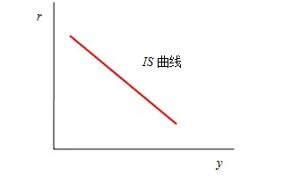
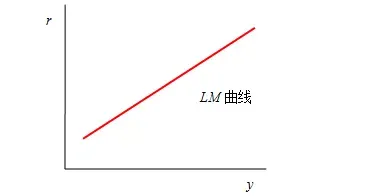
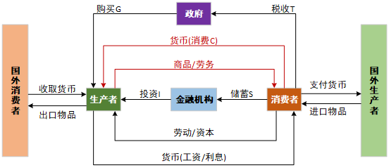
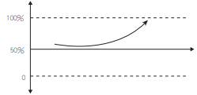
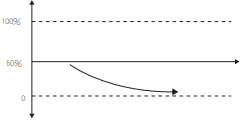

# 2.1_宏观经济学基础概念

## 1. 宏观经济简单背景

宏观经济，就是在宏观范畴以全局视角观察经济现象，分析其中的经济总量。该宏观范畴所包含的范围可以指一个国家或地区，是由众多微观个体组成的一个经济体，而这里面的微观个体可以指一个家庭、一个公司或企业。与宏观经济对应存在着微观经济，微观经济研究的就是微观个体之间供需关系、交易关系，核心反映的市场的价格理论。通过宏观经济的由来可能更容易去理解。

### 1.1 微观经济学时期

1776年，亚当斯密发布了《国富论》，标志着微观经济学的诞生。其所推崇的观念是“看不见的手”——市场万能，主张经济活动只需要自由放任即可，所有的生产、交换、分配、消费等活动完全可以由市场来调节，并不会出现太大问题。此后1803年，法国经济学家萨伊初版《政治经济学概论》，并提出著名的萨伊定律——供给会自己创造需求，也就是供给决定需求。在该定理假设下，资本主义经济总能够通过市场本身的力量，自动达到充分就业的均衡状态，而不会产生生产过剩、失业等经济危机。

### 1.2 宏观经济学开端

宏观经济学的诞生可以归结于微观经济学的解释力度在部分样例中的失效。1929年经济大危机开始，大量的银行及公司倒闭，生产下降，工人失业。按照萨伊定律，市场应该能够自我调节，但是在这次经济大危机中失去了作用，无法解释这场危机。1936年，凯恩斯《就业、利息和货币通论》发表，并提出了“不论需求量为多少，经济制度都能以不变的价格提供相应的供给量”，也就是需求决定供给。根据凯恩斯定律，经济危机的真正原因可以被归结了：有效需求不足，即有支付购买能力的能力不足，这将导致整个市场的恶性循环。

> 有效需求不足 → 资源被闲置 → 工厂减产 → 工厂解雇，失业增加 → 消费降低 → 库存积压，闲置增加 → 工厂减产 → 工厂解雇，失业增加 → 消费降低 → ……

凯恩斯从需求总量入手，主张政府干预，主动去调节经济运行，借助国家管理治理通胀，增加有效需求，刺激投资，从而实现均衡的充分就业。与微观经济学一个很大的不同，宏观经济学中强调政府在其中的作用，能够调节市场自身的不足。通过加入政府刺激与调控，金融危机中的恶行循环被打破，使资本主义经济回到正轨。

> 有效需求不足 → 资源被闲置 → 工厂减产 → 工厂解雇，失业增加 → 消费降低 → 库存积压，资源闲置增加 → 工厂减产 → 工厂解雇，失业增加 → 政府投资、货币政策 → 增加就业 → 消费恢复 → 资源利用增加 → 工厂生产恢复

### 1.3 宏观经济学研究的问题

宏观经济学实际研究的就是一个经济体整体的状况，而这一切基础就是国民收入决定理论。简单的理解就是围绕着国民收入或者国内生产总值来研究，来实现均衡的充分就业，并尝试来回答“经济危机中是什么原因导致了有效需求不足”这一问题。

在宏观经济学中，看待一个国家经济，可以考虑其国内生产总值GDP，或者说是国民收入Y。而国民收入和消费C、投资I、政府购买G、净出口（出口X-进口M）有关，也就是常说的拉动经济的四驾马车。

$$GDP=Y=C+I+G+(X-M)$$

在这个问题上，凯恩斯给出的分析是：

- 边际消费倾向递减  →  消费意愿降低  →  C降低
- 资本边际效率递减  →  资本家投资意愿降低  →  I降低
- 流动性偏好  →  货币需求和供给

根据上面国民收入的公式可以看到，经济萧条时，经济消费意愿降低，资本家投资降低，净出口也可以不考虑。那此时要想提升国民收入，恢复经济的方法就是提升政府购买。这也是凯恩斯给出的一种解决方案，扩张的财政政策。同样的，如果市场过于激进，政府也可以进行调节，对应的就是紧缩的财政政策。

可以看到，在凯恩斯的框架中，提高国民收入和实现充分就业是目的，考虑到了消费、投资、货币、需求和供给关系，这些也正是在宏观经济学中通常考虑的关键要素。

以上就是主流宏观经济学的主要研究内容，但这也只是宏观经济中的冰山一角。当然还有很多其他其他的学派，甚至有些学派并不完全认同凯恩斯的理论，但这并不妨碍我们对宏观经济的认识。最重要的是我们应该扩展思维方式，并不是认准一个方法咬住不放，毕竟所有的分析手段和策略都会有其时代的局限性。

### 1.4 宏观经济与理财的联系

投资、理财都是在分析一只只股票，是在微观层面，好像和宏观并没有太大的联系，甚至有些人完全觉得宏观无用。这有两个方面的原因：一是宏观涉及的层面太多，知识广泛，相关概念和规则不易梳理清楚；二是宏观层面人人可讲，在不同的限制条件下可以有不同的结论，导致一些人对相关数据的预测和分析近乎算命。但这些还是归结于对宏观框架及知识的不清晰：宏观变化经过时间传导最终会在微观层面体现。并且最直接的，大量的股票和债券直接和宏观经济相关，比如“经济上行，通胀上行”时，增加了持有现金的机会成本，可能出台的加息政策会降低债券吸引力，股票的配置价值较强，而商品将明显走高。这些都能很好支持个人投资理财的定位和策略确定，尤其是在宽基指数上的分析，通过宏观能够判读一段时期内国家经济和政策的制定方向，当一个国家处于经济上行期，甚至能够实现“躺着赚钱”。

## 2. 宏观经济分析及关键指标

### 2.1 教材中的宏观经济分析框架和指标

本节宏观经济学框架描述使用的凯恩斯学派理论。其内容都是围绕着“经济危机中是什么原因导致了有效需求不足？”这一问题展开的。因此通常的框架是先讲凯恩斯研究的目标：国民收入Y，或者说国内生产总值GDP；然后根据凯恩斯三个研究方面进行展开，分别是：边际消费倾向（消费）递减、资本边际效率（投资）递减、流动性偏好（货币供需），这三个结果也是凯恩斯回答“导致有效需求不足的”的答案。

注：因篇幅有限，不能涵盖所有相关的概念，只能介绍比较重要的理论概念

#### 2.1.1 国内生产总值GDP

国内生产总值（Gross Domestic Product，简称GDP），是一个国家（或地区）所有常住单位在一定时期内生产活动的最终成果。GDP是国民经济核算的核心指标，也是衡量一个国家或地区经济状况和发展水平的重要指标。GDP增长率越高，代表经济发展越快，投资市场也越好。

GDP构成与核算有三种方法：

1. 支出法：用一定时期内整个社会购买最终产品的总支出来计算GDP

$$GDP=Y=C+I+G+(X-M)$$

C：个人消费

I：国内总投资

G：政府购买

X：出口

M：进口

1. 收入法（成本法）：用生产要素在生产中所得到的各种收入加总来计算GDP，由于要素的收入从企业角度看即是产品的成本（包括企业利润），所以这种方法又称要素成本法。
2. 生产法（部门法）：把所有企业投入的生产要素新创造出的产品和服务在市场上的销售价值，按产业部门分类汇总来计算GDP。

#### 2.1.2 边际消费倾向递减 -- 国民收入决定方程

（1）边际消费倾向MPC：增加的消费ΔC和增加的收入ΔY之间的比率，也就是增加的1单位的收入中用于增加的消费部分的比率。

$$MPC=ΔC/ΔY$$

例如，第一个月工资1000，拿出来100消费；第二月工资2000，拿出来150消费，则MPC=(150-100)/(2000-1000)=0.05。边际消费倾向递减，就意味着大家都不愿意去消费，消费意愿下降。

（2）国民收入决定方程：从消费角度观察国民收入

对于收入和消费，凯恩斯认为存在消费函数： $$C=α+βY$$，C表示总消费，Y表示收入，α表示自主消费，β表示边际消费倾向MPC，取值范围为0<β<1。

将消费函数代入GDP公式，不考虑净出口（即考虑三部门经济）： 

$$Y=α+βY+I+G$$    →    $$Y=\frac{α+I+G}{1-β}$$

#### 2.1.3 资本边际效率递减 -- IS曲线

（1）资本边际效率递减

资本边际效率是凯恩斯提出的一个概念，按照他的定义，资本边际效率是一种贴现率，这种贴现率正好使一项资本物品的使用期内各预期收益的现值之和等于这项资本品的供给价格或者重置资本。资本边际效率是凯恩斯所说造成有效需求不足的三个基本心理因素之一。凯恩斯的资本边际效率，指的是预期增加一个单位投资可以得到的利润率。

（2）IS方程

对于投资和利率，凯恩斯认为存在投资函数： $$I=e-dr$$，I为投资量，e为自主投资，d为投资需求对利率变动的敏感系数，表示利率每上升或下降一个百分点，投资会减少或增加的数量，r表示利率。

将投资函数和消费函数代入GDP公式，不考虑净出口（即考虑三部门经济）： 

$$Y=α+βY+e-dr+G$$  →  $$Y=\frac{\alpha +e-dr+G}{1-\beta}$$

这就构成了收入Y和利率r之间的函数。

（3）IS曲线概念

可以看到IS曲线是一条向右下方倾斜的直线，线上任意一点都表示对应利率和收入的组合，在这样的组合下，投资I和存储S是相等的，即I=S，从而产品市场均衡，也因此称为IS曲线。

可以推导，当增加政府购买G时，IS曲线将右移，其他类似分析同理。

#### 2.1.4 流动性偏好 -- LM曲线

（1）流动性偏好

凯恩斯将人们愿意持有货币L（或存款）的动机。是指货币具有更强的使用灵活性，人们愿意将一部分财富以货币形式持有。而造成这种现象的动机有三种：

1. 交易动机：个人或企业为了进行正常的交易活动；
2. 预防动机：预防意外的发生而持有的一部分货币；
3. 投机动机：为了抓住某一可能快速盈利的投资机会。

其中交易动机和预防动机所产生的货币需求用L1表示，并与收入Y成正比：$$L1=kY$$；而投机动机所产生的货币需求量L2取决于利率r， $$L2=-hr$$ ，h为货币投机需求的利率系数，负号表示货币投机需求与利率变动存在反向变化关系。所以总的货币需求为：

$$L=L1+L2=kY-hr$$

（2）LM曲线

有货币需求，就会有货币供给，假设央行发行货币量M（在短期内可以理解为一个常数），以能够使得货币市场均衡L=M：

$$L=M$$  →  $$M=kY-hr$$  →  $$Y=\frac{M}{k}+\frac{hr}{k}$$

这也构成了收入Y和利率r之间的函数。

（3）LM曲线概念

可以看到LM曲线是一条向右上方倾斜的直线，线上任意一点都表示对应利率和收入的组合，在这样的组合下，货币需求L和货币供给M是相等的，即L=M，从而货币市场均衡，也因此称为LM曲线。

### 2.2 理财中的宏观分析框架和指标

在教材和实际理财中，宏观经济研究的对象一致，都是在评判一个经济体的整体经济状态的好坏。但由于宏观经济涉及的方面太过于广泛，相关经济指标众多，在实际的投资理财中与教材中所关注的一些指标略有不同，但这也并不是绝对的，因为在不同的分析框架之下也会有不同的关注指标。

本小结旨在建立一个简单的宏观分析框架，能够帮助快速在个人投资中认识相关指标信息，从而对宏观周期进行定位，能够达到指导投资和理财的目的。

所有的宏观经济指标数据都有专门国家部门或机构进行统计，不需要过分注重计算公式。

#### 2.2.1 宏观经济五部门

分析一个经济体时，我们从宏观层面可以将该经济体划分成五个部门：居民部门（消费）、政府部门、企业部门（生产）、金融部门和国外部门。这五部门可以看作是一个经济体的骨骼框架，可以通过设置不同的指标来观察其工作，从而了解彼此间的联动关系。

居民部门即消费者，可以看作个人。企业部门即生产者，可以看作公司。个人在公司劳动换取薪酬，然后再向其他企业部门进行消费，如去超市购物、买零食，这就完成了居民部门和企业部门的交互。同时，当个人有了大量收入后，可能会选择存银行或买基金股票，金钱就流入了金融机构，此后金钱就有了更多的流通方式，金融机构也就承担起调节各个部门收支的责任。

对于政府而言，金融部门是实施货币政策、调节宏观经济的单位。比如，一些初创公司前期为了开拓市场需要向金融部门（银行）贷款，而利率的高低是由政府部门进行宏观调控的。同时，各个公司还要向政府部门缴税，作为政府部门的收入。

国外部门就是并行存在的其他经济体。比如，中国之外的其他国家，我们通过出口产品到国外，刺激国内企业部门生产而换取外汇，通过进口国外产品，政府部门可以税收，促进居民部门消费。

#### 2.2.2 社融 -- 社会融资规模 -- 金融部门数据

社融即社会融资规模，该指标代表境内非金融企业和住户（如初创公司、个体户等）从金融体系获得的资金。

社融属于金融部门数据，是一个流量的概念，其反映了金融对实体经济资金支持的总量指标，我们也可以将该数据理解为对货币的需求量，一般观察其新增社融。社融可以分为以下几类：

1. 表内业务：指计入资产负债表的金融机构所从事的业务，如人民币贷款、外币贷款；
2. 表外业务：指不计入资产负债表的金融机构所从事的盈利业务，如委托贷款、信托贷款、未贴现银行承兑汇票；
3. 直接融资：政府债券、企业债券、非金融企业境内股权等；
4. 其他项目：保险公司赔偿、投资性房地产、贷款公司贷款等，以及其他更小的业务。

在上述分类中，人民币贷款、政府债券和企业债权的加和占比通常能占社融的90%，一般重点观察这三项的新增数据，并能反映出不同部门的需求。

1. 人民币贷款体现居民部门的融资情况：中长期贷款增加说明消费者看好经济走向；
2. 企业债券是企业部门融资的有力支撑：中长期贷款增加说明生产者看好经济走向；
3. 一般经济下行期，政府债券增加，通过政府部门项目将资金投入到实体经济，改善经济。

#### 2.2.3 M2 -- 广义货币供应量 -- 金融部门数据

货币可以分为三个层次：

- M0：流通中的货币
- M1：狭义货币供应量，M0+企业货期存款+机关团体存款+农村存款+个人信用卡存款
- M2：广义货币供应量，M1+城乡居民储蓄存款+企业定期存款+外币存款+信托类存款

在实际经济活动中，很多时候M2和社融的走势很相近，他俩的区别在于观察视角差异：M2是从银行负债端展示了传统渠道释放的货币量，社融是从实体企业角度考虑金融对企业的支持。M2增速快，意味着货币供应量快速增加，这会导致社会需求膨胀，带来通货膨胀压力。

社融 - M2增速差 ：社融与M2的增速差代表了货币供需矛盾，社融增速快，说明不计入银行资产端的资金需求比较旺盛，比如说企业大量发行了债券进行融资。

M1-M2增速差：这个指标是股票投资重要参照。M1主要代表流通中的现金和企业活期存款，M2主要是在M1基础上增加了居民储蓄存款和企业定期存款，其增速差值代表了资金活化程度。其值结果增加表示可以用于投资的货币多，货币流动性就好。

#### 2.2.4 利率 -- 金融部门数据

利率是利息额和借贷金额的比率，即利息/本金。当利率上升，借贷成本就会提高，企业部门就不愿贷款而降低生产；利率下降，企业部门融资成本下降，也就会有更大动力投入生产。所以利率高低能够影响整个经济体内的总需求，进而影响消费和投资。

中国的基准利率体系，宏观经济中常关注的三种利率：

1. 上海银行间同业拆借利率（SHIBOR）：银行间相互借贷时的利率，每个交易日根据信用等级较高的18家报价行的报价，剔除最高、最低报价，对其余报价进行算术平均后，于11点对外发布的不同期限利率。该指标能够观察银行间资金是否充裕，当SHIBOR下降时说明银行资金宽裕，市场中货币充足，现金保值能力不强。
2. 贷款市场报价利率（LPR）：银行向居民、企业等部门借贷时的利率，根据信用等级较高的18家报价行的报价，在公开市场操作利率（主要指中期借贷便利利率MLF）基础上加点，剔除最高、最低报价，对其余报价进行算术平均后，对外发布的不同期限利率。可以理解为MLF为央行借给其他银行钱的利率，其他银行再次基础上再加上一点价形成LPR后，再借给居民或企业。
3. 国债收益率：国债是政府发行的债券，国家根据收益率曲线来进行政策调整，其收益率受政策和交易双重影响，反映市场上不同期限债券的利率水平，具有国内经济先行指标的作用。

#### 2.2.5 存款准备金 -- 金融部门数据

存款准备金是金融机构为了保证客户提取存款和资金清算而预留的资金。很多国家以法律形式明确规定了存款准备金率，也就是金融机构（银行）每吸收一定存款，就要按照存款准备金率上交一部分准备金，这个目的是为了保证金融机构能够健康稳定运营，留有一定的流动性，一定程度上保护储户的资金安全。

央行通过调整存款准备金率，能够改变市场的货币流动性。比如法定存款准备金率为10%，某银行吸收了1000W存款，该银行就需要上交100W到央行，这时还有900W可以作为贷款放出市场；如果准备金率为20%，则该银行只有800W作为贷款放出市场。而实际情况中，该银行放出的贷款也会流向其他银行，其他银行也会按照该比例上交准备金，因此货币的乘数就会被限制。准备金率越高，则流动性越差。平时所说的“降准”就是降低存款准备金率。

#### 2.2.6 CPI -- 消费者价格指数 -- 居民部门数据

居民消费者价格指数CPI，是从反映与居民生活有关的商品及劳务价格统计出来的物价变动指标，是衡量通货膨胀程度的重要指标。里面包含了食品烟酒、衣着、居住、生活用品及服务、交通和通信、教育文化娱乐、医疗保健、其他用品和服务等8大类、数百个基本分类，综合衡量了居民所有消费支出中所占比重。

CPI能够准确表现消费价格变动趋势和走向，CPI上升1%就意味着居民生活成本提高1%。通常，当CPI>3%的增幅时会被认定为进入了通货膨胀区间。

#### 2.2.7 社零 -- 社会消费品零售总额数据 -- 企业部门数据

社会消费品零售总额是指企业 ( 单位、个体户 ) 通过交易直接售给个人、社会集团（包括机关、社会团队、部队、学校等单位）用于消费、非生产、非经营用的实物商品金额，以及提供餐饮服务所取得的收入金额。简单来说，像日常购买的衣服鞋帽，办公物品，它们最终目的都是被使用的，而不是为了增值，这就属于社会消费品零售总额的统计。但购买房产就不算，区分的关键在于是否最终用于消费、非生产、非经营，或者说直接点这个数据是重点反映生活消费品。

社会消费品零售总额统计采用全面调查和抽样调查相结合的方法，同时辅之以科学推算。 一般数据图表中会有规模以上和规模以下分类，可以简单认为规模以上为企业，经营稳健，数据质量好，计算便捷；规模以下主要是小企业，他们承担了更多的就业。

社零数据反映宏观经济运行情况，代表了居民及企业部门消费能力和意愿，既可以反映经济体内消费品总规模，也可以反映消费整体结构。但社零是一个滞后（或同步）指标，只有当经济好转，居民收入提高，需求才会提高，消费额才能够增加。

#### 2.2.8 固定资产投资总额 -- 政府部门数据

固定资产投资额，是指以货币形式表现的在一定时期内建造和购置固定资产的工作量和与此有关的费用的总称。

指标作用：通常固定资产投资的拉动对GDP增长有直接影响。历史数据表明，固定资产投资与GDP整体走势一致性较强。当投资增加，上游原材料及商品劳务需求都会增长，这些能够转换为收入再次转化为消费。

固定资产投资结构主要是三大类，基建投资占25%、制造业投资占30%、房地产投资占20%：

1. 基建投资全称是基础设施建设投资，主要是指交通运输、仓储和邮政电力等公共设施管理业；
2. 制造业包括31个制造行业的相关指标；
3. 房地产开发，主要开发房屋建筑物、配套服务设施、土地开发等；
4. 其他农林渔牧、采矿、批发零售也在固定资产投资里面，只不过占比较小。

#### 2.2.9 PPI -- 工业生产者出厂价格指数 -- 企业部门数据

工业生产者价格指数PPI，衡量工业企业产品出厂价格变动趋势和变动程度，是反映某一时期生产领域价格变动情况的重要经济指标。

PPI分类可以按照二分法分为生产资料和生活资料，其中前者占比较大约70%，因此PPI更能反映生产资料价格状态。此外，由于价格指数具有粘性，PPI通常落后于宏观经济，因为经济好转后产生需求，才能带动上游生产，这时才可以反映到PPI中，但是经济的真正好转通常需要等待一定时间。

PPI通常用来衡量经济是否景气，一般PPI在3％以下，认为经济不景气，再4％到7％左右，认为经济稳定繁荣，但到8％和9%以上，就表明经济可能过热。

#### 2.2.10 PMI -- 采购经理人指数 -- 企业部门数据

采购经理人指数PMI，包括制造业和非制造业领域，包含生产、订货、库存等多个环节，能够反映经济总体变化趋势，及企业经营活动多个侧面的运行情况。该指标通过公司采购经理人在第一时间获取当月数据，快速及时反映市场动态，因而成为非常重要的先行指标。

PMI 取值范围在 0 至 100% 之间，50% 为扩张与收缩的临界点，50%是根据新订单、生产指数、从业人员指数、供应商配送时间和原材料库存等5个扩散指数中的扩张和收缩比例汇总计算得到。高于50%，表示经济活动比上月有所扩张；低于50%，表示经济活动比上月有所收缩。PMI与临界点的距离，表示扩张和收缩的程度。在实际应用中，可以通过 PMI 运行走势监测宏观经济变化情况：

- 扩张加速：PMI 从 50% 上升到 100%，表明经济运行中的扩张成分多于收缩成分，扩张成分在增加，收缩成分在减少，经济处于扩张区间。

- 扩张减速：PMI 从 100% 下降到 50%，表明经济运行中的扩张成分多于收缩成分，但扩张成分在减少，收缩成分在增加，经济仍处于扩张区间。

- 收缩加速：PMI 从 50% 下降到 0，表明经济运行中的收缩成分多于扩张成分，扩张成分在减少，收缩成分在增加，经济处于收缩区间。

- 收缩减速：PMI 从 0 上升到 50%，表明经济运行中的收缩成分多于扩张成分，但扩张成分在增加，收缩成分在减少，经济仍处于收缩区间。

 