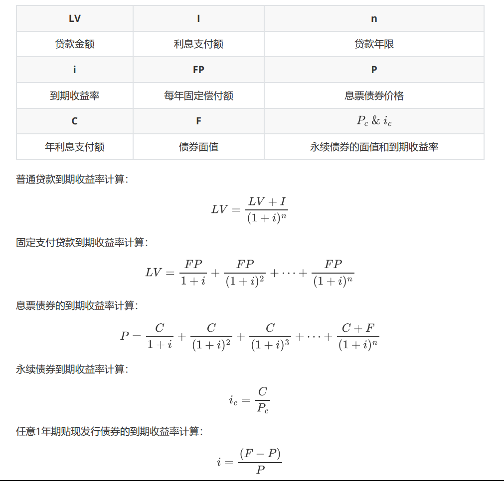
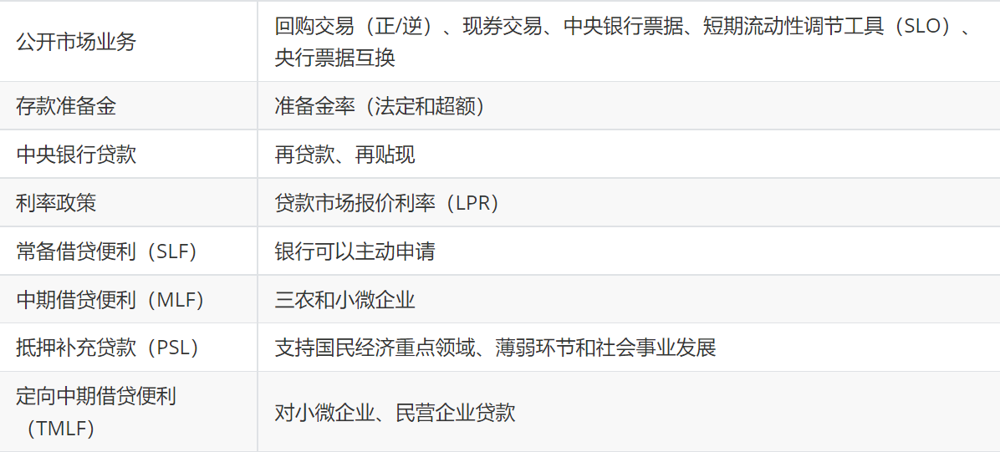
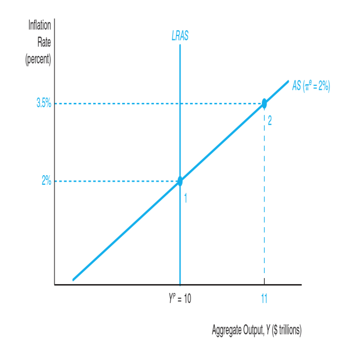
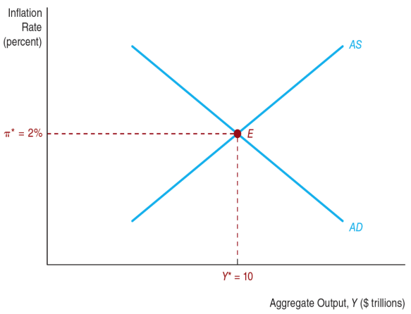
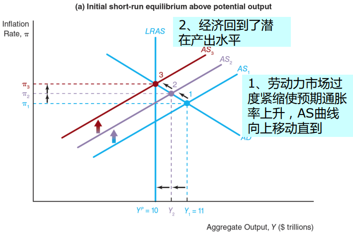
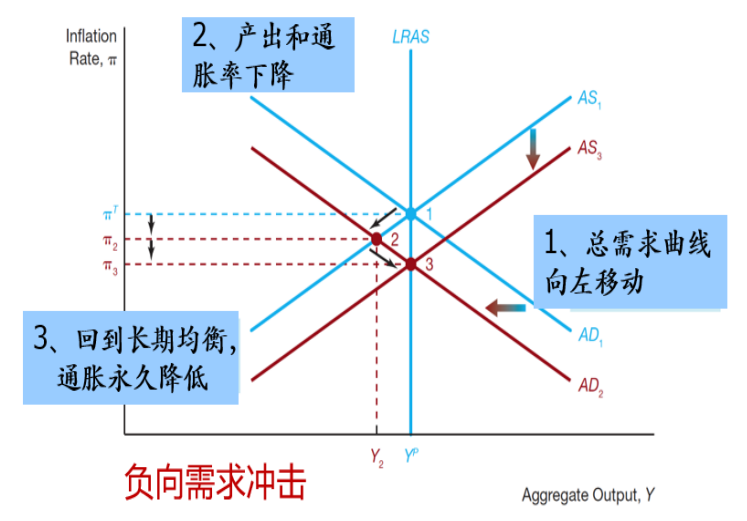
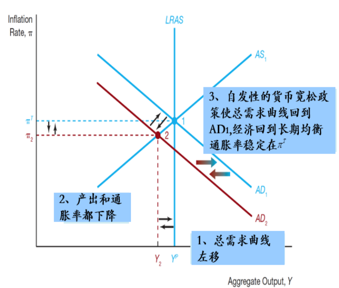
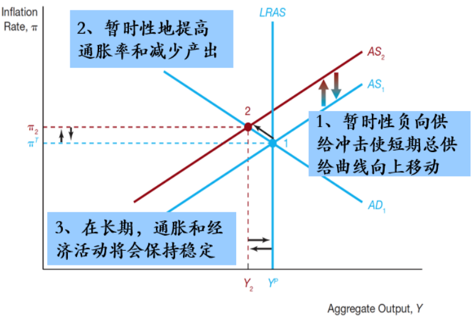
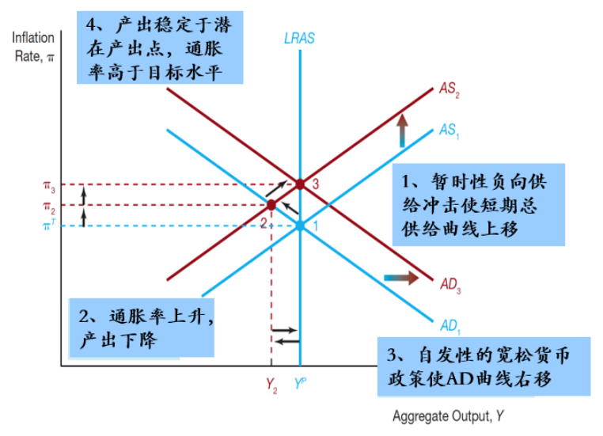

# 2.2_货币金融学基础概念

## 1. 概述

1. **金融市场**：资金从剩余方转向短缺方的市场。资金供求双方通过金融市场进行资金融通，实现金融资源有效配置，提高经济效率。
2. **债券市场**：主要的金融市场之一。
   1. 含义：发行和买卖债券的场所。
   2. 债券就是“借款的欠条”，借款人承诺在未来定期支付一定现金。利率是借入资金付出的成本（债务成本）或支付的价格（通常以一定时期内利息与本金的比率表示）。
3. **股票市场：**主要的金融市场之一。
   1. 含义：已经发行的股票，进行买卖、转让和流通的场所。
   2. 股票是“所有权的凭证”，持有股票者拥有索取一定公司收益、资产的权力，相当于拥有了公司的一部分。
4. **货币与通货膨胀**
   1. 货币：在付款或还债等经济活动中被普遍接受的物品。
   2. 通货膨胀：指物价水平（一个经济中商品和服务的平均价格）的持续性上涨，可以以CPI、PPI等指标加以衡量。
5. **货币政策与财政政策**
   1. 货币可以对许多至关重要的经济变量产生影响。
   2. 货币政策是一国的中央银行（在美国是美联储）用以管理该国货币和利率的政策。
   3. 财政政策指政府支出和税收收入的决策。根据支出和收入的大小关系，一国财政运行有三种情况：预算赤字（支出>收入）、预算盈余（支出<收入）与预算平衡（支出=收入）。
6. **外汇市场**
   1. 是各国货币兑换的场所。资金要跨国转移，必须在外汇市场上进行本国货币和外国货币的兑换。
   2. 汇率是以一种货币表示的另一种货币的价格。报告汇率时，常用单位外币兑换多少本币来计算。例如，在岸人民币报7.2525，意为1美元兑换7.2525人民币。该值上涨，说明人民币贬值。

## 2. 金融体系

1. **金融市场：**将资金从盈余方转向短缺方。
2. **直接融资与间接融资**
   1. 直接融资：借款方在金融市场上，直接卖出有价证券（如股票）给贷款方，直接获得资金。
   2. 间接融资：存在金融中介机构（如银行）。中介机构向借款方发放贷款，向贷款方借入资金。
3. **金融市场的结构**
   1. 通过筹集资金的方式来划分：债券市场和股票市场。
   2. 通过层次结构来划分：一级市场和二级市场。
      - 一级市场：发行市场或初级市场。是借款人首次出售证券时形成的市场。
      - 二级市场：证券流通市场或次级市场。是对已发行证券进行买卖、转让、流通的市场。
   3. 通过交易证券的期限划分：货币市场（交易一年内到期的短期债务工具）和资本市场（交易一年后到期的长期债务工具）
4. **金融市场工具**
   1. 货币市场工具：距离到期日不到一年，风险较低（如短期国债）。
   2. 资本市场工具：距离到期日一年以上，风险较高（如股票、公司债券）。
5. **金融中介机构**
   1. 分为：存款机构（商业银行等）、契约型储蓄机构（保险公司等），以及投资中介机构（共同基金等）
   2. 功能：降低交易成本；分担风险；减少信息不对称问题（后续会讲到）。

## 3. 货币

1. **货币：**在付款或还债等经济活动中普遍接受的物品
2. **货币的功能**
   1. 交易媒介：指货币可以用来购买产品或服务。
   2. 记账单位：指货币可以用于衡量物品或服务价值。
   3. 价值储藏：可以储存价值并在未来转化为购买力（即可以现在赚钱以后花）。
3. **货币的计量**
   1. M0：流通中的现金
   2. M1：M0+企业货期存款+机关团体存款+农村存款+个人信用卡存款
   3. M2：M1+城乡居民储蓄存款+企业定期存款+外币存款+信托类存款
   4. M3：M2+金融债券+商业票据+CDs等
   5. 从M0 -> M3，变现能力越来越差。M1是狭义货币，M2是广义货币。可以理解为，M1是生活中比较常见的，几乎可以立即用于支付的财产。

## 4. 利率

1. **现值**
   1. 即未来某笔收入在今天值多少钱。用PV表示。
   2. 计算公式为：$$PV=\frac{CF}{(1+i)^n}$$
   3.  其中：CF是（第n期的）未来现金流，i是用来折算的利率（贴现利率），n为贴现的时间跨度。

   4. 解释：未来某笔收入在今天值多少钱，可以从另一个角度理解：今天需要投入多少钱才能在未来产生该笔收入。因此，今天投入的钱为PV（也即现值），乘以n年可以产生的收益$$(1+i)^n$$，等于未来的收入CF。移项即可得该公式。
2. **信用市场工具**
   1. 普通贷款：到期向贷款人归还本金，支付额外利息的贷款。
   2. 固定支付贷款：在一定期限内，借款人每个期间（如每个月）偿还固定金额（包括本金和利息）的贷款。（可以理解为：边付息，边还贷）
   3. 息票债券：每年向持有人支付固定利息，到期偿还本金的债券。（可以理解为只付息，最后还贷）
   4. 贴现债券（零息债券）：购买价低于面值，到期按票面价值偿还的债券。（可以理解为不付息，最后还贷）
   5. 永续债券：无到期日，不要求进行本金偿还，借款人无限期定期支付固定金额利息的债券。（可以理解为一直付息，但不一定还贷）
3. **到期收益率**
   1. 含义：以特定价格购买债券，并持有至到期日能获得的报酬率。
   2. 本质上是一个利率，要求用该利率折现时，得到的未来收入的现值与当前债券的购入价格相等。
4. **到期收益率计算（ i 代表到期收益率 ）**
   1. 

   2. 注意：对到期收益率的计算，需要解出上述方程中的 i 以得到。
   3. 解释：
      - 由上文对于现值计算的解释，可以引申得到到期收益率的解释。在到期收益率计算中，我们相当于知道未来的现金流CF和现在的价值PV，要计算出一个等价的贴现利率 i （即到期收益率）使CF和PV相匹配。计算中，现金流是在不同期产生的，因此需要将它们依次分别折现后求和。
      - 永续债券比较特殊：如果不还本，方程中对未来现金流的折现是一个无穷的等比数列。使用一定数学变换可以得到上述计算公式。
5. **名义利率与实际利率**
   1. 名义利率是央行公布的，不对通货膨胀做出调整的利率。
   2. 实际利率是根据预期的物价水平变动（通货膨胀）做出调整的利率。反映了借入资金的真实成本。
   3. 即使名义利率很高，如果通货膨胀很严重，实际利率也可能很低。例如，如果债券产生收益的速度赶不上物价水平上涨的速度，那么实际利率为负，此时存钱意味着亏钱。
   4. 费雪定理：名义利率等于实际利率与预期通货膨胀率之和。

## 5. 利率的风险结构与期限结构

1. **利率的风险结构**
   1. 违约风险：借款人无力支付利息或本金的风险。国债一般被认为是无违约风险的。
   2. 风险溢价：指到期期限相同的有违约风险债券与无违约风险债券之间的利差。也即，为了让贷款人愿意承担本金或利息收不回来的风险，期限相同情况下，有违约风险的债券需要提供更高的收益率。
   3. 具有违约风险的债券的风险溢价总为正；且风险溢价随着违约风险的上升而增加。
   4. 流动性：指以较低成本迅速转化为现金的能力。流动性越差的债券越不好变现，因此越不受欢迎。这需要流动性较差的债券提供更高的收益率（与风险溢价同理），产生的利差称为流动性溢价。
   5. 所得税因素：税率越高的债券税前利率一般越高；存在税收优惠的债券利率一般相对低。
2. **利率的期限结构和收益率曲线**
   1. 利率期限结构：指其他特征相同而期限不同的各种债券利率之间的关系
   2. 收益率曲线：将期限不同，但属性类别相同的债券收益率连成的曲线。（向上倾斜：长期利率高于短期利率；平坦：两者相等；向下倾斜：长期利率低于短期利率）
   3. 利率期限结构的经验事实：
      - 不同期限债券的利率随时间一起变动
      - 短期利率低时，收益率曲线更可能向上倾斜；反之更可能向下倾斜。
      - 收益率曲线一般向上倾斜（短期利率一般低于长期利率）。

## 6. 货币供给过程

1. **货币供给**：指一国银行系统向经济中投入、创造、扩张（收缩）货币的过程
2. **货币供给量**：银行以外的企业、个人、外国持有的通货（流通中的货币）以及其他可以随时取用的存款货币的总和。也即$$M=C+D$$，其中，M表示货币供给量，C表示流通中的货币，D表示存款。
3. **货币供给过程的三位参与者**
   1. 中央银行：监督银行体系、负责实施货币政策
   2. 银行（存款机构）：作为金融中介，接受存款，发放贷款
   3. 储户
4. **准备金**：商业银行库存的现金（来自存款等）按一个比例（不小于法定准备金率）存放在中央银行的部分。
   1. 银行留有准备金，是为了遇到短期大量提取银行存款的情况时，银行拥有足够的清偿能力。
5. **中央银行和商业银行的资产及负债**
   1. 商业银行：
      - 资产包括：准备金、贷款、政府证券
      - 负债包括：银行存款、贴现贷款、资本金（即银行资本）
   2. 中央银行：
      - 资产包括：政府证券、贴现贷款
      - 负债包括：流通中的现金、准备金
   3. 解释：
      - 关于流通中的现金：是公众手中持有的货币数量，相当于中央银行向持有人开的借据。
      - 准备金是商业银行在中央银行的存款和库存现金。
6. **基础货币**：流通中的现金（C）和准备金总额（R）的和，即$$MB=C+R$$
7. **公开市场操作**：指中央银行在公开市场买卖二级市场债券，以增减货币供应量的手段，是中央银行控制基础货币的主要途径之一。
   1. 如：公开市场购买：中央银行购买债券->向银行体系输入准备金->基础货币增加
8. **向金融机构发放贷款**：中央银行以贴现贷款形式向金融机构提供贷款，也是控制基础货币主要途径之一。
   1. 如：降低再贴现利率->贷款增加->准备金增加->基础货币增加
9. **多倍存款创造**
   1. 指银行体系准备金的增加会引起存款多倍的增加。
   2. 举例：一银行获得100元存款，留有10元准备金（法定）后用90元去放贷；放贷的90元通过各种渠道流入另一银行，另一银行再留下9元法定准备金后用81元去放贷，以此类推。最后，整个银行体系的存款将增加1000元。
   3. 简单存款乘数是上述情况下，存款增加相对于初始存款的倍数，是法定存款准备金率的倒数。
   4. 上述是一个理想状态：实际上，公众选择持有现金会使存款创造终止；且银行会选择留有一定超额准备金。
10. **货币供给的决定因素**
    1. 参与者：中央银行
       - 非借入基础货币（基础货币中减去商业银行借取的准备金）：与货币供给正相关。
         - 如：公开市场购买->非借入基础货币上升->基础货币和准备金增加->货币扩张
       - 法定准备金率：与货币供给负相关
         - 如：法定准备金率降低->简单存款乘数增高->货币供给扩张
    2. 参与者：银行
       - 借入准备金：与货币供给正相关
       - 超额准备金：与货币供给负相关
         - 如：增加超额准备金->发放贷款减少->货币供给收缩
    3. 参与者：储户
       - 现金持有水平：与货币供给负相关
         - 如：现金持有增加->多倍扩张能力减弱->货币供给收缩
11. **货币乘数**
    1. 表示基础货币变动引起货币供给变动的比例。用m表示。
    2. 与基础货币和货币供给的关系：$$M=m*MB$$
    3. 计算：
       - $$m=\frac{1+c}{rr+e+c}$$
       - 其中，c表示由存款者现金持有意愿决定的通货存款比率（C/D），e表示由银行决定的超额准备金率（ER/D），以及由中央银行决定的法定存款准备金率（rr）。

## 7. 中国货币政策工具

**部分主要工具：**

1. 回购（公开市场操作）：
   1. 正回购，即中国人民银行向市场卖出证券，并约定未来某日期买回该证券的交易行为，正回购时央行向市场收回流动性，到期时向市场投放流动性。逆回购相反。
2. 准备金率：
   1. 调整法定存款准备金率：
      1. 可以通过影响货币乘数影响货币供给。
      2. 全面降准、定向降准（大型金融机构与中小型金融机构有不同存款准备金率）
   2. 调整超额存款准备金利率：
      1. 影响银行持有超额准备金收益，影响超额准备金比率，从而影响货币乘数。
3. 利率政策：
   1. 通过影响基准利率，影响居民在商业银行的储蓄利率，以及贷款市场报价利率。

## 8. 货币政策效果

1. **中央银行工具、政策工具、中介指标和货币政策目标之间的联系**
   1. 中央银行工具：公开市场操作、贴现政策、法定准备金率、准备金利息、大规模购买资产……
   2. 政策手段：准备金总量（准备金、非借入准备金、基础货币、非借入基础货币），利率（短期利率等）
   3. 中介指标：货币总量（M1/M2），利率（短期和长期利率）
   4. 目标：物价稳定、高就业、经济增长、金融市场稳定、利率稳定、外汇市场稳定
2. **泰勒规则**：指中央银行的短期利率工具依经济状态而进行调整的方法（以美联储为例）
   1.  联邦基金利率指标=通货膨胀率+均衡实际联邦基金利率+$$\frac1$$通货膨胀缺口+$$\frac1$$产出缺口
      - 通货膨胀缺口：当前通货膨胀率-目标通货膨胀率
      - 产出缺口：实际GDP增长-潜在（自然）水平下GDP增长
   2. 含义：名义利率应该顺应通货膨胀率的变化，并依据产出和通胀的缺口进行调整，以保持实际利率的稳定。

## 9. 货币数量论、通货膨胀与货币需求

1. **货币数量论**
   1. 认为其他因素不变，商品价格涨落与货币数量成正比，货币价值的高低与货币数量的多少成反比。
2. **货币流通速度**
   1. 货币流通速度$$V=\frac{(P*Y)}{M$$
   2. P代表价格水平，Y代表总收入（总产出），P*Y代表经济体名义收入，M代表货币总量（货币供给）
3. **通货膨胀**
   1. 在货币数量论下，通货膨胀率等于货币供给增长率与总产出增长率之差。
   2. 恶性通货膨胀：物价水平加速上升且完全失控，货币急剧贬值。
4. **货币需求**
   1. 人们持有货币源于：日常交易动机、预防意外动机、以及在证券市场上投机的动机。
   2. 利率与货币需求负相关，因为利率上升时持有货币机会成本增加
   3. 收入与货币需求正相关，因为交易的价值增加
   4. 其他资产风险与货币需求正相关，因为其他资产风险增加，货币风险相对降低。
   5. 通货膨胀风险与货币需求负相关，因为通胀风险增加，货币贬值相对风险上升。

## 10. 总需求与总供给分析

1. **总需求（AD）：**$$Y^{ad}=C+I+G+NX$$
   1. 总需求曲线是总需求量与通货膨胀率之间关系的曲线，向下倾斜。也可以表示为总需求量与价格之间关系，它们等效。
   2. 

   3. 消费支出C：对商品和服务的总支出
   4. 投资支出I：对实物资产与新住宅的支出
   5. 政府购买G：政府部门对特定商品和服务的支出
   6. 净出口NX：外国对本国商品和服务的净需求，等于出口减去进口。
2. **总需求曲线移动的影响因素**
   1.  关于曲线移动的解释：当总需求曲线右移时，意味着给定通胀水平（价格不变），总需求增加。

   2. 自主性货币政策：改变利率，影响投资，使曲线移动
   3. 政府购买增加：政府支出增加，曲线右移
   4. 税收增加：影响可支配收入，消费减少，曲线左移
   5. 净出口增加：直接增加总需求，曲线右移
   6. 消费意愿更强：消费增多，曲线右移
   7. 投资增加：直接增加总需求，曲线右移
   8. 金融摩擦加剧：借款实际成本上升，投资减少，总需求下降，曲线左移
3. **总供给（AS）**
   1. 总供给曲线是表示总供给量和通货膨胀率之间关系的曲线。
   2. 短期总供给曲线（SRAS 或 AS）向上倾斜，因为受预期通货膨胀率、产出缺口、通货膨胀冲击影响。
   3. 长期总供给曲线（LRAS）是一条过自然产出率水平（$$Y^$$）的垂直线。长期中，经济体的产出量受资本量、劳动力和技术决定。此时的失业率称为自然失业率。
   4. 
4. **总供给的影响因素**
   1. 短期：预期通货膨胀率上升，短期总供给曲线左移；产出缺口存在时，短期总供给曲线向潜在产出回归；通货膨胀；通货膨胀冲击也会移动短期总供给曲线。
   2. 长期：由经济中资本总量、劳动供给量增加，自然失业率水平降低，科学技术进步等缺口下，长期供给曲线右移。
5. **总供给，总需求分析的均衡**
   1. AD与SRAS的交点形成短期均衡，此状态下有均衡的总产出水平和均衡的通货膨胀率。
   2. 

   3. 如果均衡的产出水平不等于潜在水平，说明该经济没有达到长期均衡。短期均衡点此时会不断移动，直到达到潜在产出水平。
      - 解释：以短期均衡的产出高于自然产出为例。此时劳动力市场存在供不应求情况，这会推高工资水平，提高通货膨胀预期，使短期总供给曲线上移，直到短期和长期均衡重合。
      - 
6. **均衡的变动**
   1. 总需求冲击：引起总需求曲线右移的冲击（反之左移）
      1. 自主性宽松货币政策
         - AD曲线右移，短期产出增加，物价上升；
         - 中期内AS左移，产出逐渐回到潜在水平；
         - 长期内产出回到潜在水平，但物价水平永久升高
      2. 政府购买增加
      3. 税收减少
      4. 净出口增加
      5. 自主性消费支出增加（消费意愿提高）
      6. 投资增加
      7. 金融摩擦缓解
   2. 暂时性供给冲击：均衡在长期内不变，只影响短期，并会在中期逐渐调整回去
      1. 暂时性负面供给冲击使短期总供给曲线左移。如当季天气不好使农作物欠收。
   3. 永久性供给冲击：同时影响长期、短期均衡。
      1. 长期性负面供给冲击使长期和短期总供给曲线都左移。如土地荒漠化。

## 11. 货币政策理论

此部分内容绝大多数需要具体画图分析，以下大多数情况只提供结论。

1. 面对总需求负向冲击：
   1. 如果政府不作为，经济会先经历一段实际总产出低于潜在水平，失业问题严重的时期；长期内产出恢复，但通胀永久降低。
   2. 

   3. 为了短期内消除产出缺口和通胀缺口，中央银行实施自主性宽松货币政策，降低实际利率水平，从而刺激投资，使AD曲线右移。此时，政府的作为既稳定了通货膨胀，又稳定了经济活动。
   4. 
2. 面对永久性负面供给冲击：
   1. 政府可以采取自主性紧缩货币政策，推动总需求曲线左移，直到产出缺口为零。
   2. 稳定通胀和稳定经济此时不冲突。
   3. 分析与上文同理。
3. 面对暂时性负面供给冲击：
   1. 如果不进行政策反应，短期总供给曲线左移，失业率上升且通胀严重，总产出低于潜在产出。长期内恢复。
   2. 

   3. 此时存在稳定通胀和稳定经济活动的取舍。
   4. 稳定通胀：采取紧缩性的货币政策，可以使通胀回到目标值，但是相比无政策反应，此情况下总产出偏离潜在产出更加严重，不能稳定经济活动。
   5. 

   6. 稳定产出：采取宽松的货币政策，使产出回到潜在产出，但相比无政策反应，此情况下通货膨胀更加严重，不能稳定通货膨胀。
   7. 

## 12. 货币政策传导机制

1. **传统利率渠道**：货币供给M影响利率r，利率r的变化通过影响筹资成本影响投资I，最终影响总支出和总收入
   1. 以宽松的货币政策为例：
   2.  货币供给增加-->实际利率水平下降-->筹资成本降低从而投资增加-->总需求水平上升

   3. 利率在传导机制中发挥主要作用。
2. 其他资产价格渠道：
   1. 汇率影响净出口，从而影响总需求
   2. 托宾q理论：影响企业新投资，从而影响总需求
3. 信贷渠道：中央银行可以通过货币政策操作影响准备金，从而影响银行贷款发行量，影响借款人资金的筹集，影响投资与总支出水平。