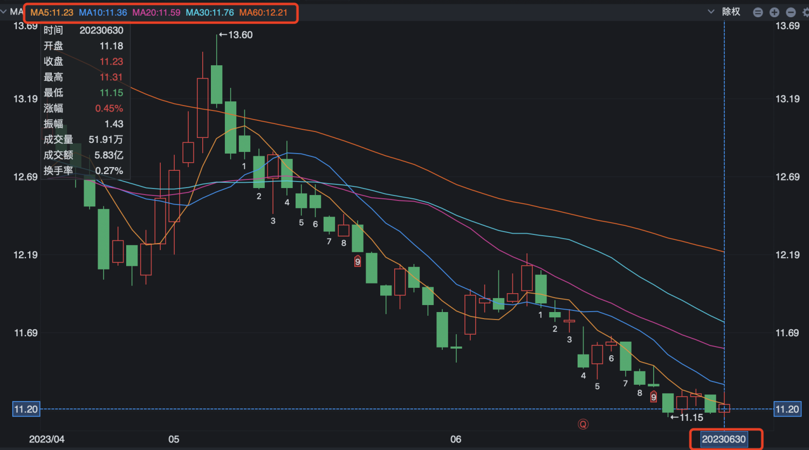
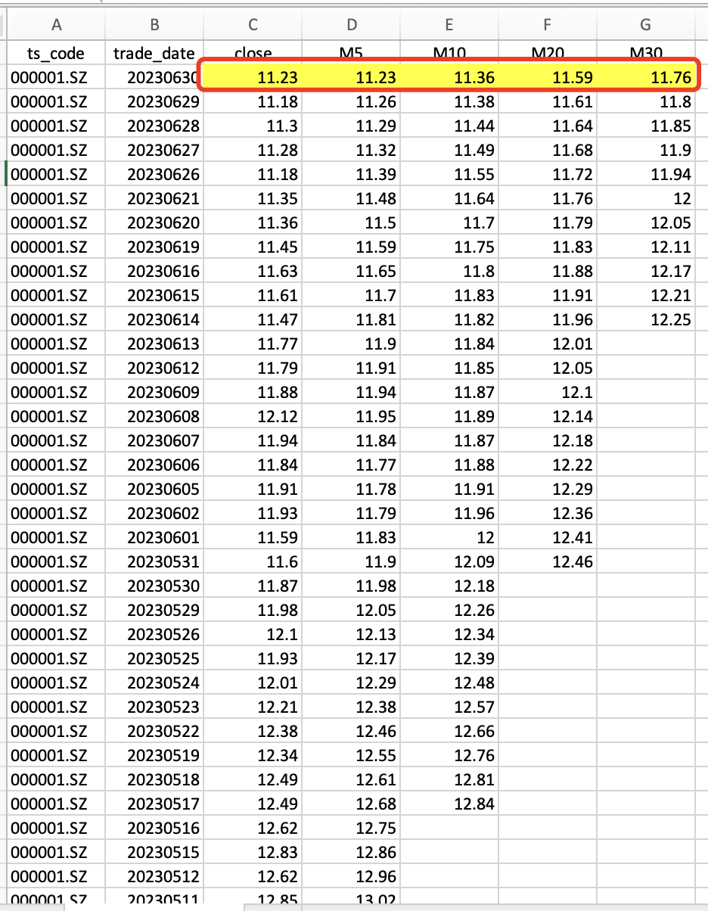
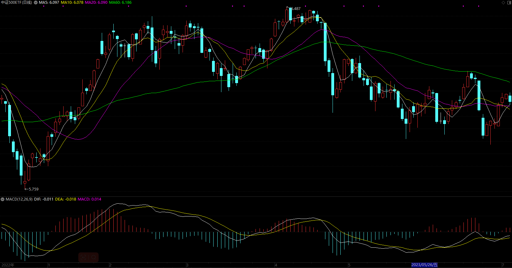
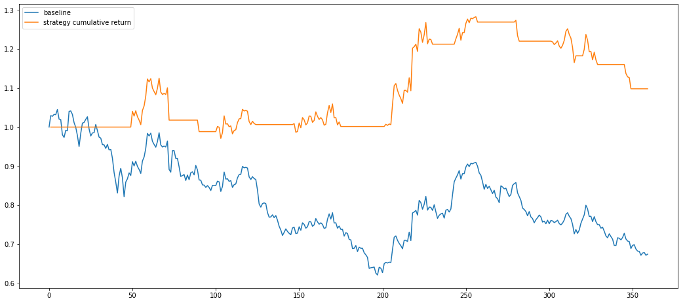

# 05_量化择时策略

目录

5.1 什么是量化择时策略

5.2 量化择时的策略

5.3 双均线择时策略

5.4 MACD均线择时策略


## 5.1 什么是量化择时

量化择时策略，简单来说，就是采用数量化分析方法，利用单个或多个技术指标的组合，来对交易标的股票或股票指数进行低买高卖的操作，期望获得超越简单买入持有策略的收益风险表现。

量化择时策略的核心是技术分析，更准确地来说，是客观型技术分析。客观型技术分析，是指其分析过程中所用到的分析方法，具有100%客观的定义标准，不含有任何主观定义的部分。

基于客观型技术分析的量化择时策略，对普通投资者具有一个很重要的意义，那就是具有很强的可传授性和可复制性 ，任何人只要花费时间精力去理解、去掌握了这些有效的量化择时策略，都可以将它们付之于实盘，获得同样令人满意的投资业绩。

### 5.1.1 量化择时的内容

正如巴菲特在谈论市场时说：“我们所经历的上个世纪反复证明，股票市场的非理性是周期性爆发的。这强烈暗示投资者应尽力去学会应对下一个股票市场的非理性爆发。而这需要的是一剂解毒剂，我认为这剂解毒剂就是量化分析。如果你定量分析，你并不一定会出色，但是你也不会坠入疯狂。”，所谓量化择时即为：根据量化指标，来选择买卖的时机。量化择时分市场整体择时、板块行业轮动择时及个股的择时。

量化择时的意义重大，如果能选择牛市、规避熊市，将能够获得非常高超额收益。尤其是在系统性风险较高、波动性比较大的、相关性较强的新兴A股市场，尤为有效。根据A股市场数据计算，从1991年1月到2010年7月的234个月月平均收益为2.18%，去掉最差的十个月（占总时间的4.27%），则收益提高到4.23%；如果去掉最好的10个月，则收益降到0.01%。如果投资者从2006年初的市场底部进入，则收益巨大；如果从2008年初进入，则亏损很多。可见选择时机进入是投资决策的首要目标，低风险区域进入能增大安全边际。

### 5.1.2 量化择时的优点

很明显，按照择时指标买卖指数基金或者一篮子成分股等，可以省去选股的复杂工作，相对于买入并持有策略，能获得较高的超额收益，并降低风险。但是择时难度也较大，我们试图通过量化的方法来择时，主要分为宏观先行指标、市场情绪指标、整体估值指标以及其他技术分析指标。主要是目标是观察和定位市场的长期状态区间（牛市或熊市），在大概率下预测中期趋势（是上涨还是下跌），及时捕捉短期拐点。一般情况下，适合大类资产配置。


## 5.2 量化择时的策略

常见的客观性技术分析有：均线、MACD、RSI等，它们都具有一个共同点，就是都有明确的数学计算公式，只要给出计算公式，任何人计算出来的结果都是一样的，比如20日简单均线，不管是谁画出来的均线都是一样的。

这些客观型技术分析指标按性能及设计特征，归纳了八种量化择时方法： 趋势择时、 Hurst指数、SWARCH模型、异常指标择时、市场情绪择时、SVM分类、有效资金模型、牛熊线。

### 5.2.1 异常指标择时

异常指标择时主要处理一些特殊情况下的择时，例如，在大盘出现顶点或者低点的时候，有些指标容易出现异常数据，主要有：市场噪声、行业集中度和兴登堡凶兆3个策略。

### 5.2.2 趋势择时

趋势择时的基本思想来自于技术分析，技术分析认为趋势存在延续性，因此只要找到趋势方向，跟随操作即可。趋势择时的主要指标有MA、MACD、DMA等，

### 5.2.3 有效资金择时

有效资金是指市场上能对趋势产生影响的资金流，同样的资金量，在趋势顶部和底部的时候，对市场的影响是不一样的。从大概率的角度来看，当股价愈接近顶部时，上涨1%所需要的主动买入资金越多，上涨也就越困难，也就是通常理解的“滞涨”或者“顶部放量”，此时的成交金额更能反应股价的高低，对于股价的指示更有效，而底部则刚好相反。

有效资金模型就是构建有效资金指标EMS（这就是该策略的构造要点）来判断一波趋势是否接近拐点的策略。

有效资金模型和选股模型中的资金流模型类似，其是通过判断推动大盘上涨或者下跌的有效资金来判断走势，因为在顶部和底部时资金效果具有额外的推动力。

EMS指标的直观解释：按照通常理解，无论是传统资金流量，还是MS、EMS指标，当指标值为正时，我们认为资金为净流入或者主动性买入资金多于主动性卖出资金，因此很多人认为该指标越大就越应该看好后市。

然而如果我们从另外一个角度来看，指标值越大说明股票的上涨阻力越来越大，因为上涨所需要付出的成交金额越大，特别是EMS指标对正向MS和负向MS按照有效性进行了加权，EMS越大时，上涨单位价格所需的资金越多，上涨阻力越大；反之，EMS越小时，下跌单位价格所需的资金越多，下跌阻力越大。

### 5.2.4 市场情绪择时

A 股市场正处于弱有效阶段，个人投资者居多，由于缺乏时间、精力及知识能力去分析股票的投资价值，
往往会受到周围人的影响，具有羊群效应。市场情绪择时就是利用投资者的热情程度（投资信心指数）来判断大势方向，当情绪热烈，积极入市时，大盘可能会继续涨；当投资者情绪低迷、不断撤出市场的时候，大盘可能继续下跌。

### 5.2.5 SVM择时

SVM是一种分类技术，具有效率高、推广性能好的优点，SVM择时就是利用SVM技术进行大盘趋势的模式识别，将大盘区分为几个明显的模式，从而找出其中的特征，然后利用历史数据学习的模型来预测未来的趋势，近些年也有类似的model。

### 5.2.6 SWARCH择时

SWARCH模型是海通证券开发的一种利用宏观经济指标来判断大盘的策略，该模型主要刻画了货币供应量M2和大盘走势之间的关系，揭示我国证券市场指数变化与货币供应量之间的相关关系。

### 5.2.7 牛熊线择时

牛熊线（年线，一般是指250日移动平均线）择时的思想就是将大盘的走势划分为两根线，一根为牛线，一根为熊线。在牛熊线之间时大盘不具备方向性，如果突破牛线，则可以认为是一波大的上涨趋势的到来；如果突破熊线，则可以认为是一波大的下跌趋势到来。

### 5.2.8 Hurst指数

Hurst指数是分形理论在趋势判断中的应用，分形市场理论认为，资本市场是由大量具有不同投资期限的投资者组成的，且信息对不同投资者的交易周期有着不同的影响。利用Hurst指数可以将市场的转折点判断出来，从而实现择时。

具体来说

赫斯特指数有三种形式：

1．如果H=0.5，表明时间序列可以用随机游走来描述；

2．如果0.5<H<1，表明时间序列存在长期记忆性；

3．如果0≤H<0.5，表明粉红噪声(反持续性)即均值回复过程。也就是说，只要H≠0.5，就可以用有偏的布朗运动(分形布朗运动)来描述该时间序列数据。


时至今日，这些基本的技术指标如果单独运用形成一套量化择时策略来指导投资买卖，往往并不能带来令人满意投资效果，但是它们所隐含的方法内涵却依然是更复杂更有效的量化择时策略的基础，是我们开发有效的量化择时策略的基本工具。

因此，在开始阶段，我们仍然有必要对这些基础技术指标进行深入研究，理解它们的构造原理，熟悉它们的性能特征.

参考：

- https://www.dxqh.net/fck/attached/file/20170112/20170112135032_0793.pdf
- https://www.htsec.com/jfimg/colimg/upload/20210301/41161614561953400.pdf
- https://wiki.mbalib.com/wiki/%E9%87%8F%E5%8C%96%E6%8B%A9%E6%97%B6
- http://www.cfachina.org/servicesupport/analygarden/jrl/fxszh6/202205/P020220520850234514295.pdf
- https://research.cicc.com/frontend/recommend/detail?id=3050
- 《量化投资—策略与技术》（丁鹏著，电子工业出版社）
- https://www.dxqh.net/fck/attached/file/20170112/20170112135032_0793.pdf
- https://www.htsec.com/jfimg/colimg/upload/20210301/41161614561953400.pdf
- https://wiki.mbalib.com/wiki/%E9%87%8F%E5%8C%96%E6%8B%A9%E6%97%B6
- http://www.cfachina.org/servicesupport/analygarden/jrl/fxszh6/202205/P020220520850234514295.pdf
- https://research.cicc.com/frontend/recommend/detail?id=3050
- 《量化投资—策略与技术》（丁鹏著，电子工业出版社）


## 5.3 双均线择时策略

### 5.3.1 均线由来

在股票市场中，均线是一个非常常见的名词术语，并且很多量化策略也都围绕着不同的均线展开。

均线也叫移动平均线，是由著名的美国投资专家Joseph E.Granville（格兰威尔）在20世纪中期提出来的，现在仍然广泛为人们使用，成为判断买卖信号的一大指标。从统计角度来说，均线就是历史价格的平均值，可以代表过去N日股价的平均走势。
1962年7月，Joseph E.Granville在他的书中提出了著名的Granville八大买卖法则。只利用股价和均线即可进行择时，方法简单有效，一经提出，迅速受到市场追捧。尤其是其中的金叉和死叉信号，更是沿用至今。Granville 八大法则其中有四条是用于判断买进时机，另外四条是用于判断卖出时机。买进和卖出法则一一对应，分布在高点的左右两侧（除买4和卖4以外）。法则内容如下所示：

- 买1：均线整体上行，股价由下至上上穿均线，此为黄金交叉，形成第一个买点。
- 买2：股价出现下跌迹象，但尚未跌破均线，此时均线变成支撑线，形成第二个买点。
- 买3：股价仍处于均线上方，但呈现急剧下跌趋势。当跌破均线时，出现第三个买点。
- 买4：（右侧）股价和均线都处于下降通道，且股价处于均线下方，严重远离均线，出现第四个买点。


- 卖1：均线由上升状态变为缓慢下降的状态，股价也开始下降。当股价跌破均线时，此为死亡交叉，形成第一个卖点。
- 卖2：股价仍处于均线之下，但股价开始呈现上涨趋势，当股价无限接近均线但尚未突破时，此时均线变成阻力线，形成第二个卖点。
- 卖3：股价终于突破均线，处于均线上方。但持续时间不长，股价开始下跌，直至再一次跌破均线，此为第三个卖点。
- 卖4：（左侧）股价和均线都在上涨，股价上涨的速度远快于均线上涨的速度。当股价严重偏离均线时，出现第四个卖点。


### 5.3.2 常见均线
常见的均线包括简单移动平均线（SMA）和指数移动平均线（EMA）。

简单移动平均线（SMA）是通过将一段时间内的价格加总，然后除以时间段的长度来计算的。例如，20日简单移动平均线是根据过去20个交易日的收盘价来计算的。

指数移动平均线（EMA）是根据指数平滑系数来计算的，它更加关注最近的价格数据。较新的价格数据会给予更高的权重，而较旧的价格数据则给予较低的权重。EMA的计算公式可以包含一个初始EMA值，以及指数平滑系数。

均线可以帮助分析趋势和价格的走势，以及确定潜在的买入和卖出信号。例如，当价格上涨并且价格位于均线之上时，这可能被视为一个买入信号。相反，当价格下跌并且价格位于均线之下时，这可能被视为一个卖出信号。

许多量化策略使用不同时间长度的均线来比较，以确定交易信号。例如，交叉均线策略使用两条不同长度的移动均线，当短期均线穿过长期均线时产生交易信号。

需要注意的是，均线是一种技术工具，仅作为参考和辅助分析工具。在使用均线进行决策时，还需要结合其他技术指标和市场因素进行综合分析。


### 5.3.3 均线计算

我们结合金融软件具体查看一下该指标。目前各大金融软件基本都提供移动平均值的计算，如下截图展示了平安银行（000001.SZ）
2023年4月到6月的估价走势，在右上角展示了5日移动平均值（M5）、10日移动平均值（M10）、20日移动平均值（M20）、30日移动平均值（M30）。
为了进一步计算验证，本文拉取了20230501 - 20230630 交易日每天的日行情数据，根据收盘价计算，可以看出该[计算结果](result.csv)与金融产品上展示的数据一致。







**代码示例**

```python
"""
使用tushare库来获取股票数据，并对数据进行处理和计算移动平均值。
"""

import tushare as ts

# https://tushare.pro/user/token
tushare_token = '0858b935f4518d9e56ffeb19910dc13e296291364ea1d7bd574eb84b'
ts.set_token(tushare_token)
pro = ts.pro_api(tushare_token)

# 个股数据 https://tushare.pro/document/2?doc_id=27
# 从tushare获取个股数据，从2023年5月1日到2023年6月30日期间获取股票代码为000001.SZ的数据，字段包括交易代码、交易日期和收盘价。
df = pro.daily(ts_code='000001.SZ', start_date='20230501', end_date='20230630', fields='ts_code,trade_date,close')
df = df.sort_values(by='trade_date')

# 使用.rolling()函数计算收盘价的移动平均值，分别为5天、10天、20天和30天，并将结果存储在M5、M10、M20和M30列中。
df['M5'] = df.close.rolling(window=5).mean().round(2)
df['M10'] = df.close.rolling(window=10).mean().round(2)
df['M20'] = df.close.rolling(window=20).mean().round(2)
df['M30'] = df.close.rolling(window=30).mean().round(2)

# 对数据按交易日期进行降序排序，以便按照日期从新到旧的顺序显示数据。
df = df.sort_values(by='trade_date', ascending=False)
print("前10条数据：\n", df.head(10))
df.to_csv('result.csv', index=False)
```

### 5.3.4 双均线策略

**策略原理**：使用两根均线，一根长周期均线，一根短周期均线。当短期均线从下往上穿越长周期均线的时候，买入；当短期均线从上往下穿越长周期均线的时候，卖出。前文介绍的Granville 八大法则也是一种双均线策略，其短周期均线为M1（当日收盘价）。均线根据不同周期有以下分类：

- 短期均线：5、7、10，用于预测短期走势，MA5 和 MA10 又称为短期监测线；
- 中期均线：20、30、60，用于预测中期走势，MA20 和 MA30 又称为警戒线， MA60 则称之为生死线；
- 长期均线：120、250，用于长期走势，MA120 又称为确认线，MA250 则通常被看做反转线，又称为牛熊分界线。


**策略缺陷**：
- **滞后性**：均线归根到底是一种平均值，在应用中存在的最大问题就是滞后性。当出现买入卖出信号时，最佳时机早已过去。举例来说，如果A股票最新价格出现了较大的涨幅，股价和均线都上涨，但均线的速度慢于股价上涨速度。此时，从形态上来看，金叉出现，为买入信号。次日，股价回调，股价下降的速度快于均线下降的速度，形成死叉，为卖点。这样一买一卖不仅没有盈利，反而出现亏损。
- **长短周期难以选择**：如果两根均线的周期接近，比如5日线，10日线，这种非常容易缠绕，不停的产生买点卖点，会有大量的无效交易，交易费用很高。如果两根均线的周期差距较大，比如5日线，60日线，这种交易周期很长，趋势性已经不明显了，趋势转变以后很长时间才会出现买卖点。也就是说可能会造成很大的亏损。所以两个参数选择的很重要，趋势性越强的品种，均线策略越有效。

**策略优化尝试方向**：
- **使用加权移动平均值**：均线策略的一大缺陷是指标具有滞后性，因此可以使用加权移动平均值代替移动平均值。计算时将短期（如昨天）的权重增大，以加强指标的敏感性。
- **不局限于收盘价**：可以尝试将最高价、最低价等加入到加权移动平均值的计算中。
- **自适应调整均线周期**：价格走势进入单边上涨趋势，自适应均线自动缩短周期，采用短期均线，转为向上移动；市场走势进入横盘震荡，自适应均线自动延长周期，采用长期均线，转为横向移动。


### 5.3.5 Python实践：双均线择时策略
```python
import numpy as np
import pandas as pd
import matplotlib.pyplot as plt
import tushare as ts

# 设置tushare token
# tushare_token = 'your_tushare_token'
tushare_token = '0858b935f4518d9e56ffeb19910dc13e296291364ea1d7bd574eb84b'
ts.set_token(tushare_token)
pro = ts.pro_api()

# 获取股票数据
df = pro.daily(ts_code='000001.SZ', start_date='20210101', end_date='20230630', fields='trade_date,close')

# 计算短期均线和长期均线
df['MA5'] = df['close'].rolling(window=5).mean()
df['MA20'] = df['close'].rolling(window=20).mean()

# 生成交易信号
df['signal'] = np.where(df['MA5'] > df['MA20'], 1, -1)

# 计算当天持仓状态
df['position'] = df['signal'].diff()

# 回测策略
df['return'] = df['close'].pct_change()  # 计算每日收益率
df['strategy_return'] = df['position'].shift() * df['return']  # 计算每日持仓收益

# 计算累计收益率
df['cumulative_return'] = (1 + df['strategy_return']).cumprod()

# 可视化结果
plt.plot(df['trade_date'], df['cumulative_return'])
plt.xlabel('Date')
plt.ylabel('Cumulative Return')
plt.title('Dual Moving Average Strategy')
plt.xticks(rotation=45)
plt.show()
```

在这个示例代码中，我们使用了tushare库获取了股票代码为000001.SZ的股票数据。然后，计算了其中的短期均线（5日均线）和长期均线（20日均线）。根据这两条均线的交叉情况，生成了买入和卖出的信号。如果短期均线在长期均线之上，产生买入信号（1），如果短期均线在长期均线之下，产生卖出信号（-1）。

接下来，我们根据这些信号计算了每天的持仓状态，持仓状态的变化显示了买入和卖出的时机。然后，通过计算每日收益率和策略的收益率，我们可以回测该策略的表现。最后，我们计算了累计收益率，并使用Matplotlib可视化了策略的表现。

请注意，这只是一个示例代码，你可以根据自己的需求和策略进行修改和优化。在实际应用时，还需要考虑交易成本、滑点、止损和止盈等因素。投资有风险，建议在实际操作之前进行充分的研究和回测。


## 5.4 MACD均线择时策略
### 5.4.1 MACD简介

MACD称为异同移动平均线（Moving Average Convergence and Divergence），是由指数均线演变而来的，由Gerald Appel在1979年提出，是一个比较常见的技术指标。MACD指标通过对金融资产价格的收盘价进行平滑处理，生成了两线一柱组合，其中两线是快速线DIF（Difference Line）和慢速线DEA（Signal Line），一柱是柱状图MACD。MACD指标是快速线DIF与慢速线DEA的差，可以反映出股票近期价格走势的变化强弱和能量，用于把握股票的准确买卖点。


### 5.4.2 MACD计算

**短期EMA：**短期（如，12天）的收盘价指数移动平均值，一般采用EMA(price, 12)

**长期EMA：**长期（如，26天）的收盘价指数移动平均值，一般采用EMA(price, 26)

**DIF：**短期EMA与长期EMA的差值，即DIF=EMA(price, 12)-EMA(price, 26)

**DEA：**DIF的多日（如，9天）指数移动平均值，即DEA=EMA(DIF, 9)

**MACD：**DIF线与DEA线的差，即MACD=DIF-DEA


### 5.4.3 依据MACD进行择时

当MACD从负数转向正数，快速线DIF自下而上穿过慢速线DEA时，形成金叉，即买入信号。

当MACD从正数转向负数，快速线DIF自上而下穿过慢速线DEA时，形成死叉，即卖出信号。

当MACD以大角度变化，表示快的移动平均线和慢的移动平均线的差距非常迅速的拉开，代表了一个市场大趋势的转变

上述用法是MACD指标最直接且最经典的用法，具有完全的客观判断标准，可以很方便的用计算机来实现，并对其进行历史测试。MACD还有其他许多用法，比如底背离、顶背离等，但这些用法中的主观判断成份很重，没有统一客观的使用标准，不同的人使用的结果可能大不一样，也难以用计算机来实现。

中证500ETF在2022年12月到2023年6月的走势如下图，MACD指标在下方的窗格。




### 5.4.4 MACD指标的优缺点

相比双均线策略，MACD将两条线转换成了单个指标，更容易观察，并且避免了双均线策略里两条均线经常在震荡行情下经常发生交叉的现象出现，减少频繁发出假信号的缺陷，MACD适用于研判中长期走势。

MACD指标的核心功能在于度量均线势能的变化，或者说是股价的二阶差变化，当股价上涨开始乏力时，MACD指标往往能较早的发出卖出信号，使得策略能在股价开始拐头下跌时及时离场，这是MACD指标具有较好风险控制能力的原因。

但是，当遇到大型的趋势上涨行情时，MACD指标可能会错误地过早离场，虽然根据策略逻辑，之后还会继续发出买入信号，但难免错失一段利润，所以在趋势上涨行情中，MACD策略的投资收益会不如股票指数的自身涨幅。


### 5.4.5 Python实践：MACD均线择时策略

```python
import numpy as np
import pandas as pd
import talib as ta 
# Joinquant数据下载API
from jqdatasdk import *
# 登录验证
auth("Your_phonenum", "Your_passwd")
import matplotlib.pyplot as plt

# 下载数据
# 下载2015-2018年的沪深300指数，频率为每天，只要收盘价
price = get_price("000300.XSHG", start_date="2015-01-01", end_date="2018-12-31", frequency="daily", fields=['close'])['close']
# 用python自带的tseries库中的pct_change()函数计算日收益率
ret = price.pct_change()

# 用talib库中的相应函数计算MACD指标
dif, dea, macd = ta.MACD(price)
# 只考虑MACD指标，MACD转正时开仓买入，转负时清仓
sig = (macd>0)

# sig滞后一期、去除空值、转换成整数
sig_lag = sig.shift(1).fillna(0).astype(int)
# sig_lag与股票日收益率相乘，即可得策略日收益率。python能自动对齐时间序列的日期。
sig_ret = sig_lag*ret
# 计算策略累计收益
cum_sig_ret = (1+sig_ret).cumprod()

# 把股票价格转换成从1开始，方便比较
price_norm = price/price[0]

# 简单起见，这里不考虑手续费，作图比较该策略和“买入-持有”策略的表现。
plt.figure(figsize=(18,8))
plt.plot(price_norm)
plt.plot(cum_sig_ret)
plt.legend(["benchmark", "strategy cumulative return"], loc="upper left")
plt.show()
```

