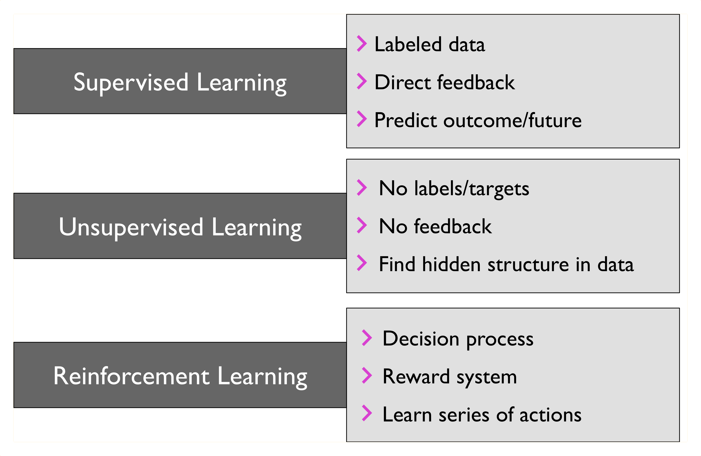
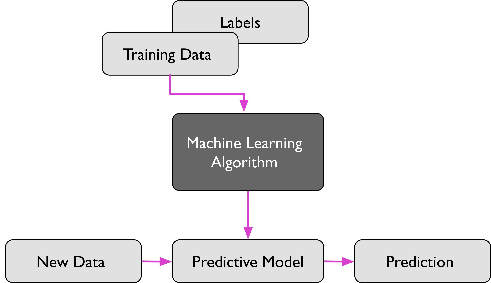

# 8.2 机器学习分类与量化选股

## 1. 机器学习简介

### 1.1 概述

在如今的科技时代，大数据和互联网的飞速发展为我们带来了丰富的结构化（数值型数据）和非结构化数据（文本、图像和音频等复杂数据）。为了处理这些丰富的数据，机器学习应运而生，并在20世纪下半叶逐渐演变为 **人工智能**（Artifical Intelligence，AI）的一个重要分支。

机器学习是通过算法理解和分析数据的应用和科学，也是计算机科学中最令人兴奋的领域。它通过自学习算法从已知数据集中获得特征模式（Feature Pattern）来对未知数据预测。机器学习并不需要事先对大量数据进行人工分析，进而提取规则并简历模型。相反，它提供了一种更为有效的方法来提取数据中的知识，逐步提高模型的预测性能，以完成数据驱动的决策。



<center> 图1 机器学习的类别 </center>

如图1所示，机器学习的应用范围大致可以分为三类：

- 监督学习：预测未来
- 强化学习：解决交互问题
- 无监督学习：发现隐藏的结构

本章所涉及的机器学习分类与量化选择则属于其中的监督学习，接下来，本章将对监督学习进行讨论。监督学习的主要目标是从有标签的训练数据中学习模型，以便对未知或已知的数据进行预测。在这里，“监督”（Supervised）的意思是已经知道训练样本（Training data）中期待的输出信号（Labels）。



<center> 图2 典型的监督学习流程 </center>

图2 总结了典型的机器学习流程，首先，借助训练数据对机器学习算法模型进行拟合，再模型得到充分训练之后，利用拟合好的模型对新数据集（即没有标签的数据）进行预测。监督学习又可以分为两个主要任务：分类和回归。

在8.1章中，我们使用了支持向量机来预测股票的价格，这属于典型的 **回归任务**，回归任务指的是监督学习的结果信号是连续的数值，如价格。与之相对的，如果预测结果信号为离散的分类标签，则该任务被称之为 **分类任务**。例如，在量化选股中，我们要决定是否选择该只股票进行投资，则属于典型的 **二分类任务**。

> **注**：机器学习领域的预测变量常常被称为 **特征**（Features），而响应变量通常被称为 **目标变量**（Target Variables）或 **标签**（Labels），本章的后续内容将沿用该命名规则。

近年涌现出许多强大的机器学习开源软件（库），如 `scikit-learn` ，`keras` 等，借助这些强大的算法可以轻松从数据中发现模式并预测未来。

### 1.2  LightGBM 原理（选）

在本章后续的实战中，将会使用由 Google  2017 年提出的LightGBM 来进行量化选股，因此，本小节对该算法的算法原理进行介绍。该算法是一种基于梯度提升决策树（Gradient Boosting Decision Tree，GBDT）改进的集成学习模型。得益于梯度单边采样（Gradient-based One-side Sampling，GOSS）和互斥特征捆绑（Exclusive Feature Bunding，EFB）两大技术，LightGBM 具备了预测精度高、训练速度快等优点，正逐渐成为数据挖掘问题的主流解决方案。

给定具有标注信息的数据集： $X = \left\{ {({x_i},{y_i})} \right\}_{i = 1}^n$, $n$ 是样本总数 ，LightGBM 旨在估计对特定函数  $\widehat {f(x)}$  进行估计进而得到  ${f^*}(x)$ ，该函数满足既定损失函数  $L\left( {y,f(x)} \right)$  的最小期望损失值 ，即：

$$
\widehat f = \arg \mathop {\min }\limits_f {E_{y,x}}L(y,f(x))
$$


LightGBM 集成了一组回归树来逼近最终的模型，即：

$$
{F_T}(X) = \sum\limits_{t = 1}^T {{f_t}(X)} 
$$

其中，$T$ 表示回归树的数量，$F_T(X)$ 表示最终的回归树模型。回归树也可以表示为 ${w_{q(x)}}$，$q \in \left\{ {1,2, \ldots ,J} \right\}$，其中 $w$ 是叶子节点的样本权重向量，$J$ 表示叶子数量，而 $q$ 则表示分类回归树的决策规则。因此，LightGBM 在每一个步骤 $t$ 以加权的形式进行训练，如下述公式所示：
$$
{\Gamma _t} = \sum\limits_{t = 1}^n {L({y_{i,}}{F_{t - 1}}(x_i)}  + {f_t}({x_i}))
$$

利用牛顿法消去上式中的常数项，可以变形得到：

$$
\begin{aligned}
		\Gamma _t &\cong \sum\limits_{t = 1}^n {({g_i}{f_t}({x_i})}  + \frac{1}{2}{h_i}f_t^2({x_i}))\\
		& = \sum\limits_{j = 1}^n ((\sum\limits_{i \in {I_j}} {g_i}){w_j} + \frac{1}{2}(\sum\limits_{i \in {I_j}} {h_i} + \lambda )w_j^2)
	\end{aligned}
$$

其中，$g_i$ 和 $h_i$ 分别表示损失函数的一阶与二阶梯度统计量。而  $I_j$ 表示叶子节点 $j$，$\lambda$ 是正则化权重。那么对于树形结构 $q(x)$，每个叶子节点 $w_j^*$ 的最优叶节点权重分数 ${\Gamma _K}$  求解得到的极值如下：
$$
\begin{aligned}
		w_j^*& = \frac{{\sum\nolimits_{i \in {I_j}} {{g_i}} }}{\sum\nolimits_{i \in {I_j}} {{h_i} + \lambda } }\\
		\Gamma _T^*& =  - \frac{1}{2}\sum\limits_{j = 1}^J \frac{{{{\left( {\sum\nolimits_{i \in {I_j}} {{g_i}} } \right)}^2}}}{{\sum\nolimits_{i \in {I_j}} {{h_i} + \lambda } }} 
	\end{aligned}
$$
其中，$\Gamma _T^*$ 可以看作是衡量树形结构 的评价函数。合并之后，该优化问题的目标函数通过变换之后得到：
$$
G = \frac{1}{2}\left( {\frac{{{{\left( {\sum\nolimits_{i \in {I_L}} {{g_i}} } \right)}^2}}}{{\sum\nolimits_{i \in {I_L}} {{h_i}}  + \lambda }} + \frac{{{{\left( {\sum\nolimits_{i \in {I_L}} {{g_i}} } \right)}^2}}}{{\sum\nolimits_{i \in {I_R}} {{h_i}}  + \lambda }} - \frac{{{{\left( {\sum\nolimits_{i \in I} {{g_i}} } \right)}^2}}}{{\sum\nolimits_{i \in I} {{h_i}}  + \lambda }}} \right)
$$

其中，$I_L$ 和 $I_R$ 分别表示样本集的左右分支。不同于以往的基于梯度提升决策树的技术，LightGBM 可以在垂直方向上生成树，而其他的算法基本都是横向扩充树，这种改进使得前者在大规模数据和特征的处理中表现更为出色。


## 2. Python实践：利用机器学习分类进行量化选股

### 2.1 概述

接下来，我们使用上述学到的知识，借助 LightGBM 机器学习模型，进行量化选股实践操作。首先需要把选股问题转化为监督学习的问题。那么如何转化呢？常规的一些方法是预测股价增长来进行选股，此处，为简单期间，我们将其转化为一个分类问题：考虑短期策略搭建，即持股周期不能多于5天。如果一支股票在 **未来5天里最高增长大于5%，最大损失大于-3%**，我们将其标签标记为 `1`，即选择该股进行投资，其他标签标记为 `0`，即不选择。

解决一个监督学习通常有以下步骤：

1. 收集训练样本并进行特征选择（特征工程）；
2. 选择度量性能的指标
3. 选择模型并优化算法；
4. 评估模型的性能；
5. 样本外预测。

以下我们将用代码实现我们的选股方案。

### 2.2 数据下载

借助 `tushare` 工具，可以轻松地下载股票信息，此处主要用到了两个数据：

- `company_info.csv`：此数据表包含股票的基础信息数据，包含股票代码、名称、上市日期、退市日期等，需要注意的是，`tushare` 账号只有达到 120 个积分才能下载此数据（且一个小时只能引用借口一次），可以通过注册（100积分），然后修改信息（20积分）完成。当然，本代码也会直接提供该信息表。
- `ts_code + _NormalData.csv`：此数据集，包含 `company_info.csv` 中的所有股票交易信息，可以通过下面的代码进行免费爬取。

1. **获取股票基础信息**：以便后续爬取股票的交易信息


```python
import tushare as ts
import pandas as pd
import os
import numpy as np
import time
from tqdm import tqdm

"""
获取历史数据
"""

save_path = './stock'
if not os.path.exists(save_path):
    os.mkdir(save_path)
    
# 存储股票交易信息    
stock_inf_path = os.path.join(base_path,  'OldData')
if not os.path.exists(stock_inf_path):
    os.mkdir(stock_inf_path)
    
company_path = os.path.join(save_path, 'company_info.csv')

# 设置起始日期
startdate = '20180701'
enddate = '20230630'


# 获取基础信息数据，包括股票代码、名称、上市日期、退市日期等    
if os.path.exists(company_path):
    pool = pd.read_csv(company_path, encoding='utf-8', index_col = 0)
else:
    mytoken = ' '
    ts.set_token(mytoken)
    pro = ts.pro_api()
    pool = pro.stock_basic(exchange='',
                           list_status='L',
                           adj='qfq',
                           fields='ts_code, symbol,name,area,industry,fullname,list_date, market,exchange,is_hs')

    # 因为穷没开通创业板和科创板权限，这里只考虑主板和中心板
    pool = pool[pool['market'].isin(['主板', '中小板'])].reset_index()
    pool.to_csv(os.path.join(save_path, 'company_info.csv'), index=False, encoding='utf-8')

print('获得上市股票总数：', len(pool)-1)
```

2. 爬取股票的交易信息


```python
if os.path.exists(path):
    pass
```


```python
j = 1
for i in pool.ts_code:
    print('正在获取第%d家，股票代码%s.' % (j, i))
    # 接口限制访问200次/分钟，加一点微小的延时防止被ban
    path = os.path.join(stock_inf_path, i + '_NormalData.csv')
    j += 1
    
    if os.path.exists(path):
        pass
    else:
        time.sleep(0.301)
        df = ts.pro_bar(ts_code=i, start_date=startdate, end_date=enddate, freq='D')
        try:
            df = df.sort_values('trade_date', ascending=True)
            df.to_csv(path, index=False)
        except:
            print(i)
```

结果：

```python
正在获取第1家，股票代码000001.SZ.
正在获取第2家，股票代码000002.SZ.
正在获取第3家，股票代码000004.SZ.
...
正在获取第3185家，股票代码605598.SH.
正在获取第3186家，股票代码605599.SH.
```


### 2.3 数据预处理

- 变量定义


```python
pool.head()
```

Result:

<table border="1" class="dataframe">
  <thead>
    <tr style="text-align: right;">
      <th></th>
      <th>ts_code</th>
      <th>symbol</th>
      <th>name</th>
      <th>area</th>
      <th>industry</th>
      <th>fullname</th>
      <th>market</th>
      <th>exchange</th>
      <th>list_date</th>
      <th>is_hs</th>
    </tr>
    <tr>
      <th>index</th>
      <th></th>
      <th></th>
      <th></th>
      <th></th>
      <th></th>
      <th></th>
      <th></th>
      <th></th>
      <th></th>
      <th></th>
    </tr>
  </thead>
  <tbody>
    <tr>
      <th>0</th>
      <td>000001.SZ</td>
      <td>1</td>
      <td>平安银行</td>
      <td>深圳</td>
      <td>银行</td>
      <td>平安银行股份有限公司</td>
      <td>主板</td>
      <td>SZSE</td>
      <td>19910403</td>
      <td>S</td>
    </tr>
    <tr>
      <th>1</th>
      <td>000002.SZ</td>
      <td>2</td>
      <td>万科A</td>
      <td>深圳</td>
      <td>全国地产</td>
      <td>万科企业股份有限公司</td>
      <td>主板</td>
      <td>SZSE</td>
      <td>19910129</td>
      <td>S</td>
    </tr>
    <tr>
      <th>2</th>
      <td>000004.SZ</td>
      <td>4</td>
      <td>国华网安</td>
      <td>深圳</td>
      <td>软件服务</td>
      <td>深圳国华网安科技股份有限公司</td>
      <td>主板</td>
      <td>SZSE</td>
      <td>19910114</td>
      <td>N</td>
    </tr>
    <tr>
      <th>3</th>
      <td>000005.SZ</td>
      <td>5</td>
      <td>ST星源</td>
      <td>深圳</td>
      <td>环境保护</td>
      <td>深圳世纪星源股份有限公司</td>
      <td>主板</td>
      <td>SZSE</td>
      <td>19901210</td>
      <td>N</td>
    </tr>
    <tr>
      <th>4</th>
      <td>000006.SZ</td>
      <td>6</td>
      <td>深振业A</td>
      <td>深圳</td>
      <td>区域地产</td>
      <td>深圳市振业(集团)股份有限公司</td>
      <td>主板</td>
      <td>SZSE</td>
      <td>19920427</td>
      <td>S</td>
    </tr>
  </tbody>
</table>

可以发现，股票交易信息中有不少离散变量，因此，需要对这些离散变量进行编码，如下是一些编码变量的设置


```python
# 模型训练
import numpy as np
import pandas as pd
import os
import tqdm

base_path = 'stock'

market_map = {'主板':0, '中小板':1}
exchange_map = {'SZSE':0, 'SSE':1}
is_hs_map = {'S':0, 'N':1, 'H':2}

area_map = {'深圳': 0, '北京': 1, '吉林': 2, '江苏': 3, '辽宁': 4, '广东': 5, '安徽': 6, '四川': 7, '浙江': 8,
            '湖南': 9, '河北': 10, '新疆': 11, '山东': 12, '河南': 13, '山西': 14, '江西': 15, '青海': 16, 
            '湖北': 17, '内蒙': 18, '海南': 19, '重庆': 20, '陕西': 21, '福建': 22, '广西': 23, '天津': 24, 
            '云南': 25, '贵州': 26, '甘肃': 27, '宁夏': 28, '黑龙江': 29, '上海': 30, '西藏': 31}

industry_map = {'银行': 0, '全国地产': 1, '生物制药': 2, '环境保护': 3, '区域地产': 4, '酒店餐饮': 5, '运输设备': 6, 
 '综合类': 7, '建筑工程': 8, '玻璃': 9, '家用电器': 10, '文教休闲': 11, '其他商业': 12, '元器件': 13, 
 'IT设备': 14, '其他建材': 15, '汽车服务': 16, '火力发电': 17, '医药商业': 18, '汽车配件': 19, '广告包装': 20, 
 '轻工机械': 21, '新型电力': 22, '饲料': 23, '电气设备': 24, '房产服务': 25, '石油加工': 26, '铅锌': 27, '农业综合': 28,
 '批发业': 29, '通信设备': 30, '旅游景点': 31, '港口': 32, '机场': 33, '石油贸易': 34, '空运': 35, '医疗保健': 36,
 '商贸代理': 37, '化学制药': 38, '影视音像': 39, '工程机械': 40, '软件服务': 41, '证券': 42, '化纤': 43, '水泥': 44, 
 '专用机械': 45, '供气供热': 46, '农药化肥': 47, '机床制造': 48, '多元金融': 49, '百货': 50, '中成药': 51, '路桥': 52, 
 '造纸': 53, '食品': 54, '黄金': 55, '化工原料': 56, '矿物制品': 57, '水运': 58, '日用化工': 59, '机械基件': 60, 
 '汽车整车': 61, '煤炭开采': 62, '铁路': 63, '染料涂料': 64, '白酒': 65, '林业': 66, '水务': 67, '水力发电': 68, 
 '互联网': 69, '旅游服务': 70, '纺织': 71, '铝': 72, '保险': 73, '园区开发': 74, '小金属': 75, '铜': 76, '普钢': 77, 
 '航空': 78, '特种钢': 79, '种植业': 80, '出版业': 81, '焦炭加工': 82, '啤酒': 83, '公路': 84, '超市连锁': 85, 
 '钢加工': 86, '渔业': 87, '农用机械': 88, '软饮料': 89, '化工机械': 90, '塑料': 91, '红黄酒': 92, '橡胶': 93, '家居用品': 94,
 '摩托车': 95, '电器仪表': 96, '服饰': 97, '仓储物流': 98, '纺织机械': 99, '电器连锁': 100, '装修装饰': 101, '半导体': 102, 
 '电信运营': 103, '石油开采': 104, '乳制品': 105, '商品城': 106, '公共交通': 107, '船舶': 108, '陶瓷': 109}
```

- 离散变量编码


首先是上市公司数据读取，这里简单对是否是ST公司进行了处理。


```python
def JudgeST(x):
    if 'ST' in x:
        return 1
    else:
        return 0
    
col = ['open', 'high', 'low', 'pre_close',]

company_info = pd.read_csv(os.path.join(base_path, 'company_info.csv'), encoding='utf-8')
company_info['is_ST'] = company_info['name'].apply(JudgeST)

# 丢弃一些多余的信息
company_info.drop(['index', 'symbol', 'fullname'], axis=1, inplace=True)
company_info.dropna(inplace=True)
company_info['market'] = company_info['market'].map(market_map)
company_info['exchange'] = company_info['exchange'].map(exchange_map)
company_info['is_hs'] = company_info['is_hs'].map(is_hs_map)
```

- 读取股票交易信息

读取股票交易信息，这里去掉一下上市不久的企业


```python
stock_info = pd.DataFrame()
remove_stock = []
tmp_list = []
for ts_code in tqdm.tqdm(company_info['ts_code']):
    tmp_df = pd.read_csv(os.path.join(stock_inf_path, ts_code + '_NormalData.csv'))
    
    # 还需要去除一些停牌时间很久的企业
    if len(tmp_df) < 100:  # 去除一些上市不久的企业
        remove_stock.append(ts_code)
        continue
    tmp_df = tmp_df.sort_values('trade_date', ascending=True).reset_index()
    tmp_list.append(tmp_df)

stock_info = pd.concat(tmp_list)

# 定义交易日期映射
tmp_list = list(stock_info['trade_date'].unique())
date_map = dict(zip(tmp_list, range(len(tmp_list))))

ts_code_map = dict(zip(stock_info['ts_code'].unique(), range(stock_info['ts_code'].nunique())))
stock_info = stock_info.reset_index()
stock_info['ts_code_id'] = stock_info['ts_code'].map(ts_code_map)
stock_info.drop('index', axis=1, inplace=True)
stock_info['trade_date_id'] = stock_info['trade_date'].map(date_map)
stock_info['ts_date_id'] = (10000 + stock_info['ts_code_id']) * 10000 + stock_info['trade_date_id']
stock_info = stock_info.merge(company_info, how='left', on='ts_code')
stock_info_copy = stock_info.copy()
```

    100%|██████████████████████████████████████████████████████████████████████████████████| 3186/3186 [00:04<00:00, 773.88it/s]


```python
stock_info.head()
```

Result:

<table border="1" class="dataframe">
  <thead>
    <tr style="text-align: right;">
      <th></th>
      <th>level_0</th>
      <th>ts_code</th>
      <th>trade_date</th>
      <th>open</th>
      <th>high</th>
      <th>low</th>
      <th>close</th>
      <th>pre_close</th>
      <th>change</th>
      <th>pct_chg</th>
      <th>...</th>
      <th>trade_date_id</th>
      <th>ts_date_id</th>
      <th>name</th>
      <th>area</th>
      <th>industry</th>
      <th>market</th>
      <th>exchange</th>
      <th>list_date</th>
      <th>is_hs</th>
      <th>is_ST</th>
    </tr>
  </thead>
  <tbody>
    <tr>
      <th>0</th>
      <td>0</td>
      <td>000001.SZ</td>
      <td>20180702</td>
      <td>9.05</td>
      <td>9.05</td>
      <td>8.55</td>
      <td>8.61</td>
      <td>9.09</td>
      <td>-0.48</td>
      <td>-5.28</td>
      <td>...</td>
      <td>0</td>
      <td>100000000</td>
      <td>平安银行</td>
      <td>深圳</td>
      <td>银行</td>
      <td>0</td>
      <td>0</td>
      <td>19910403</td>
      <td>0</td>
      <td>0</td>
    </tr>
    <tr>
      <th>1</th>
      <td>1</td>
      <td>000001.SZ</td>
      <td>20180703</td>
      <td>8.69</td>
      <td>8.70</td>
      <td>8.45</td>
      <td>8.67</td>
      <td>8.61</td>
      <td>0.06</td>
      <td>0.70</td>
      <td>...</td>
      <td>1</td>
      <td>100000001</td>
      <td>平安银行</td>
      <td>深圳</td>
      <td>银行</td>
      <td>0</td>
      <td>0</td>
      <td>19910403</td>
      <td>0</td>
      <td>0</td>
    </tr>
    <tr>
      <th>2</th>
      <td>2</td>
      <td>000001.SZ</td>
      <td>20180704</td>
      <td>8.63</td>
      <td>8.75</td>
      <td>8.61</td>
      <td>8.61</td>
      <td>8.67</td>
      <td>-0.06</td>
      <td>-0.69</td>
      <td>...</td>
      <td>2</td>
      <td>100000002</td>
      <td>平安银行</td>
      <td>深圳</td>
      <td>银行</td>
      <td>0</td>
      <td>0</td>
      <td>19910403</td>
      <td>0</td>
      <td>0</td>
    </tr>
    <tr>
      <th>3</th>
      <td>3</td>
      <td>000001.SZ</td>
      <td>20180705</td>
      <td>8.62</td>
      <td>8.73</td>
      <td>8.55</td>
      <td>8.60</td>
      <td>8.61</td>
      <td>-0.01</td>
      <td>-0.12</td>
      <td>...</td>
      <td>3</td>
      <td>100000003</td>
      <td>平安银行</td>
      <td>深圳</td>
      <td>银行</td>
      <td>0</td>
      <td>0</td>
      <td>19910403</td>
      <td>0</td>
      <td>0</td>
    </tr>
    <tr>
      <th>4</th>
      <td>4</td>
      <td>000001.SZ</td>
      <td>20180706</td>
      <td>8.61</td>
      <td>8.78</td>
      <td>8.45</td>
      <td>8.66</td>
      <td>8.60</td>
      <td>0.06</td>
      <td>0.70</td>
      <td>...</td>
      <td>4</td>
      <td>100000004</td>
      <td>平安银行</td>
      <td>深圳</td>
      <td>银行</td>
      <td>0</td>
      <td>0</td>
      <td>19910403</td>
      <td>0</td>
      <td>0</td>
    </tr>
  </tbody>
</table>
<p>5 rows × 23 columns</p>


```python
stock_info.columns
```

Result:


```python
Index(['level_0', 'ts_code', 'trade_date', 'open', 'high', 'low', 'close',
       'pre_close', 'change', 'pct_chg', 'vol', 'amount', 'ts_code_id',
       'trade_date_id', 'ts_date_id', 'name', 'area', 'industry', 'market',
       'exchange', 'list_date', 'is_hs', 'is_ST'],
      dtype='object')
```

### 2.4 特征工程

接下来是一些简单的特征工程。首先是把收盘价、开盘价、最低价、最高价变换一个尺度（相当于盈亏比），若不转换直接放进模型训练可能会增加训练成本。


```python
stock_info = stock_info_copy.copy()
col = ['close', 'open', 'high', 'low']
feature_col = []
for tmp_col in col:
    stock_info[tmp_col+'_'+'transform'] = (stock_info[tmp_col] - stock_info['pre_close']) / stock_info['pre_close']
    feature_col.append(tmp_col+'_'+'transform')
```

- 提取前5天收盘价与今天收盘价的盈亏比


```python
for i in range(5):
    tmp_df = stock_info[['ts_date_id', 'close']]
    tmp_df = tmp_df.rename(columns={'close':'close_shift_{}'.format(i+1)})
    feature_col.append('close_shift_{}'.format(i+1))
    tmp_df['ts_date_id'] = tmp_df['ts_date_id'] + i + 1
    stock_info = stock_info.merge(tmp_df, how='left', on='ts_date_id')
stock_info.drop('level_0', axis=1, inplace=True)
# stock_info.dropna(inplace=True)

for i in range(5):
    stock_info['close_shift_{}'.format(i+1)] = (stock_info['close'] - stock_info['close_shift_{}'.format(i+1)]) / stock_info['close_shift_{}'.format(i+1)]
```

- 定义被预测变量（标签 Labels）

在标签制作时，如果一支股票在未来5天里最高增长大于5%，最大损失大于-3%，我们将其标签标记为1，其他标签标记为0。在制作标签时为了防止股价拉到5%瞬间掉下来，此处加了一点容错（6%）。


```python
use_col = []
for i in range(5):
    tmp_df = stock_info[['ts_date_id', 'high', 'low']]
    tmp_df = tmp_df.rename(columns={'high':'high_shift_{}'.format(i+1), 'low':'low_shift_{}'.format(i+1)})
    use_col.append('high_shift_{}'.format(i+1))
    use_col.append('low_shift_{}'.format(i+1))
    tmp_df['ts_date_id'] = tmp_df['ts_date_id'] - i - 1
    stock_info = stock_info.merge(tmp_df, how='left', on='ts_date_id')

stock_info.dropna(inplace=True)

for i in range(5):
    stock_info['high_shift_{}'.format(i+1)] = (stock_info['high_shift_{}'.format(i+1)] - stock_info['close']) / stock_info['close']
    stock_info['low_shift_{}'.format(i+1)] = (stock_info['low_shift_{}'.format(i+1)] - stock_info['close']) / stock_info['close']

tmp_array = stock_info[use_col].values
max_increse = np.max(tmp_array, axis=1)
min_increse = np.min(tmp_array, axis=1)
stock_info['label_max'] = max_increse
stock_info['label_min'] = min_increse
stock_info['label_final'] = (stock_info['label_max'] > 0.06) & (stock_info['label_min'] > -0.03)
stock_info['label_final'] = stock_info['label_final'].apply(lambda x: int(x))
stock_info = stock_info.reset_index()
stock_info.drop('index', axis=1, inplace=True)
```

### 2.5 模型训练

模型数据输入准备：这里我们选取了18年7月1日至21年12月31日的数据作为训练集，22年1月1号至22年6月30号的数据作为验证集，22年7月1日至23年6月30日的数据作为回测数据。


```python
trn_col = ['open', 'high', 'low', 'close', 'pre_close', 'change', 'pct_chg', 'vol', 'amount', 'ts_code_id'] + feature_col
label = 'label_final'
trn_date_min = 20180701
trn_date_max = 20211231
val_date_min = 20220101
val_date_max = 20220630
test_date_min = 20220701
test_date_max = 20230630

trn_data_idx = (stock_info['trade_date'] >= trn_date_min) & (stock_info['trade_date'] <= trn_date_max)
val_data_idx = (stock_info['trade_date'] >= val_date_min) & (stock_info['trade_date'] <= val_date_max)
test_data_idx = (stock_info['trade_date'] >= test_date_min) & (stock_info['trade_date'] <= test_date_max)

trn = stock_info[trn_data_idx][trn_col].values
trn_label = stock_info[trn_data_idx][label].values

val = stock_info[val_data_idx][trn_col].values
val_label = stock_info[val_data_idx][label].values 

test = stock_info[test_data_idx][trn_col].values
test_label = stock_info[test_data_idx][label].values
```


```python
print('rate of 0: %.4f, rate of 1: %.4f' % (np.sum(trn_label==0)/len(trn_label), np.sum(trn_label==1)/len(trn_label)))
print('trn data:%d, val data:%d, test data:%d' % (len(trn), len(val), len(test)))
print('number of features:%d' % len(trn_col))
```

Results:

```python
rate of 0: 0.7954, rate of 1: 0.2046
trn data:2402113, val data:358934, test data:743100
number of features:19
```

- 模型训练及评价

```python
# 模型训练及评价
import lightgbm as lgb
from sklearn import metrics

params = {
        'learning_rate': 1e-3,
        'boosting_type': 'gbdt',
        'objective': 'binary',
        'metric': 'mse',
        'num_leaves':128,
        'feature_fraction': 0.8,
        'bagging_fraction': 0.8,
        'bagging_freq': 5,
        'seed': 1,
        'bagging_seed': 1,
        'lambda_l1': 0.1,
        'feature_fraction_seed': 7,
        'min_data_in_leaf': 20,
        'nthread': -1,
        'verbose': -1
    }

trn_data = lgb.Dataset(trn, trn_label)
val_data = lgb.Dataset(val, val_label)
num_round = 2000
clf = lgb.train(params, trn_data, num_round, valid_sets=[trn_data, val_data])
            
oof_lgb = clf.predict(val, num_iteration=clf.best_iteration)
test_lgb = clf.predict(test, num_iteration=clf.best_iteration)
```

### 2.6 模型评价

- 验证集

接下来，我们用混淆矩阵和敏感度来评估模型在验证集和测试集中的效果。


```python
oof_lgb_final = np.round(oof_lgb)
print(metrics.accuracy_score(val_label, oof_lgb_final))
print(metrics.confusion_matrix(val_label, oof_lgb_final))
tp = np.sum(((oof_lgb_final == 1) & (val_label == 1)))
pp = np.sum(oof_lgb_final == 1)
print('sensitivity:%.3f'% (tp/(pp)))
```

Results:

```python
0.8009522642045613
[[287418     58]
 [ 71387     71]]
sensitivity:0.550
```


在验证集中，模型敏感度为0.550，意思就是选了100个股票，55支股票在未来5天涨幅能达到5%。

- 测试集

在测试集中，我们调了阈值，模型敏感度为0.769。


```python
thresh_hold = 0.6
oof_test_final = test_lgb >= thresh_hold
print(metrics.accuracy_score(test_label, oof_test_final))
print(metrics.confusion_matrix(test_label, oof_test_final))
tp = np.sum(((oof_test_final == 1) & (test_label == 1)))
pp = np.sum(oof_test_final == 1)
print('sensitivity:%.3f'% (tp/(pp)))
```

```python
0.8282653747813215
[[615464      6]
 [127610     20]]
sensitivity:0.769
```


这里我们假设在每天即将收盘的时候买入股票（在即将收盘的时候可以利用获取的实时行情来选股，获取的各项指标可以近似为当日收盘后的指标）。所以，在测试集中选出来的股票并不一定能买入，因为会有一些涨停股票，这里我们需要筛选掉一些涨停股票。

在筛选的时候我们直接判断当日收盘价是否等于当日最高价。尝试过先判断是否ST，再判断涨幅，但是现在不是ST的之前可能是ST。（这个筛选后期可以改进）


```python
test_postive_idx = np.argwhere(oof_test_final == 1).reshape(-1)
test_all_idx = np.argwhere(test_data_idx).reshape(-1)

# 查看选了哪些股票
tmp_col = ['ts_code', 'name', 'trade_date', 'open', 'high', 'low', 'close', 'pre_close',
       'change', 'pct_chg', 'amount', 'is_ST', 'label_max', 'label_min', 'label_final']
# stock_info.iloc[test_all_idx[test_postive_idx]]

tmp_df = stock_info[tmp_col].iloc[test_all_idx[test_postive_idx]].reset_index()
# idx_tmp = tmp_df['is_ST'] == 0
# tmp_df.loc[idx_tmp, 'is_limit_up'] = (((tmp_df['close'][idx_tmp]-tmp_df['pre_close'][idx_tmp]) / tmp_df['pre_close'][idx_tmp]) > 0.095)
# idx_tmp = tmp_df['is_ST'] == 1
# tmp_df.loc[idx_tmp, 'is_limit_up'] = (((tmp_df['close'][idx_tmp]-tmp_df['pre_close'][idx_tmp]) / tmp_df['pre_close'][idx_tmp]) > 0.047)

tmp_df['is_limit_up'] = tmp_df['close'] == tmp_df['high']

buy_df = tmp_df[(tmp_df['is_limit_up']==False)].reset_index()
buy_df.drop(['index', 'level_0'], axis=1, inplace=True)
```

统计了一下，一共有8支股票在未来可以选择，3支股票能够有5%以上收益。


```python
print(len(buy_df), sum(buy_df['label_final']))
```

Results:

```python
8 3
```


```python
buy_df
```

Results:

<table border="1" class="dataframe">
  <thead>
    <tr style="text-align: right;">
      <th></th>
      <th>ts_code</th>
      <th>name</th>
      <th>trade_date</th>
      <th>open</th>
      <th>high</th>
      <th>low</th>
      <th>close</th>
      <th>pre_close</th>
      <th>change</th>
      <th>pct_chg</th>
      <th>amount</th>
      <th>is_ST</th>
      <th>label_max</th>
      <th>label_min</th>
      <th>label_final</th>
      <th>is_limit_up</th>
    </tr>
  </thead>
  <tbody>
    <tr>
      <th>0</th>
      <td>001266.SZ</td>
      <td>宏英智能</td>
      <td>20220715</td>
      <td>28.61</td>
      <td>31.77</td>
      <td>28.61</td>
      <td>30.03</td>
      <td>31.79</td>
      <td>-1.76</td>
      <td>-5.5363</td>
      <td>156186.779</td>
      <td>0</td>
      <td>0.264069</td>
      <td>-0.013653</td>
      <td>1</td>
      <td>False</td>
    </tr>
    <tr>
      <th>1</th>
      <td>002118.SZ</td>
      <td>*ST紫鑫</td>
      <td>20230421</td>
      <td>1.45</td>
      <td>1.57</td>
      <td>1.45</td>
      <td>1.55</td>
      <td>1.61</td>
      <td>-0.06</td>
      <td>-3.7267</td>
      <td>148677.359</td>
      <td>1</td>
      <td>0.090323</td>
      <td>-0.045161</td>
      <td>0</td>
      <td>False</td>
    </tr>
    <tr>
      <th>2</th>
      <td>002157.SZ</td>
      <td>*ST正邦</td>
      <td>20221031</td>
      <td>3.29</td>
      <td>3.54</td>
      <td>3.29</td>
      <td>3.50</td>
      <td>3.66</td>
      <td>-0.16</td>
      <td>-4.3716</td>
      <td>378127.452</td>
      <td>1</td>
      <td>0.191429</td>
      <td>0.002857</td>
      <td>1</td>
      <td>False</td>
    </tr>
    <tr>
      <th>3</th>
      <td>003007.SZ</td>
      <td>直真科技</td>
      <td>20230426</td>
      <td>23.16</td>
      <td>24.50</td>
      <td>23.16</td>
      <td>23.84</td>
      <td>25.36</td>
      <td>-1.52</td>
      <td>-5.9937</td>
      <td>120034.276</td>
      <td>0</td>
      <td>0.057466</td>
      <td>-0.004614</td>
      <td>0</td>
      <td>False</td>
    </tr>
    <tr>
      <th>4</th>
      <td>600766.SH</td>
      <td>*ST园城</td>
      <td>20230420</td>
      <td>12.52</td>
      <td>13.00</td>
      <td>12.33</td>
      <td>12.99</td>
      <td>13.70</td>
      <td>-0.71</td>
      <td>-5.1825</td>
      <td>155419.309</td>
      <td>1</td>
      <td>0.092379</td>
      <td>-0.278676</td>
      <td>0</td>
      <td>False</td>
    </tr>
    <tr>
      <th>5</th>
      <td>603025.SH</td>
      <td>大豪科技</td>
      <td>20230322</td>
      <td>15.82</td>
      <td>16.89</td>
      <td>15.82</td>
      <td>16.55</td>
      <td>17.24</td>
      <td>-0.69</td>
      <td>-4.0023</td>
      <td>517699.533</td>
      <td>0</td>
      <td>0.086405</td>
      <td>-0.026586</td>
      <td>1</td>
      <td>False</td>
    </tr>
    <tr>
      <th>6</th>
      <td>603768.SH</td>
      <td>常青股份</td>
      <td>20221014</td>
      <td>18.11</td>
      <td>19.39</td>
      <td>18.11</td>
      <td>19.02</td>
      <td>20.12</td>
      <td>-1.10</td>
      <td>-5.4672</td>
      <td>188629.117</td>
      <td>0</td>
      <td>-0.023659</td>
      <td>-0.101998</td>
      <td>0</td>
      <td>False</td>
    </tr>
    <tr>
      <th>7</th>
      <td>605255.SH</td>
      <td>天普股份</td>
      <td>20221223</td>
      <td>14.11</td>
      <td>15.00</td>
      <td>13.91</td>
      <td>14.78</td>
      <td>15.46</td>
      <td>-0.68</td>
      <td>-4.3984</td>
      <td>81158.673</td>
      <td>0</td>
      <td>-0.004060</td>
      <td>-0.075101</td>
      <td>0</td>
      <td>False</td>
    </tr>
  </tbody>
</table>

## Reference

- Sebastian Raschka, Vahid Mirjalili. Python Machine Learning (Third Edition). China Machine Press.
- [选股策略搭建（三）（量化模型搭建）](https://mp.weixin.qq.com/s/LLE3Oe8x13BdAqjCs4Geqw)
- [Tushare 官网](https://tushare.pro/document/2?doc_id=25)